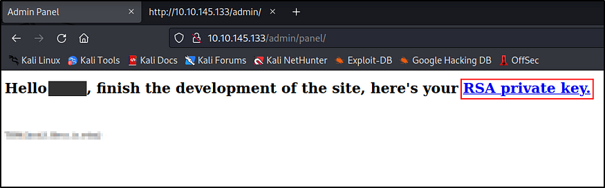

### **https://tryhackme.com/room/bruteit**

### **Task 2: Reconnaissance**

**Q1: Firstly, we need to run a nmap scan to find out which ports are open and which services are running on these ports.**

**Nmap (Network Mapper)** is a free and open source utility for network discovery and security auditing.

nmap -A -T4 -O -p- -sV

```
nmap -A -T4 -O -p- 10.10.145.133
```

**\-A :** Enable OS detection, version detection, script scanning and traceroute.

**\-T4 :** Set timing template (higher is faster).

**\-O :** Enable OS detection.

**\-p- :** You can specify **“-p-”** to scan ports from 1 through 65535. ( We have to search all ports because question is asking total of open ports )


**Q2: What version of SSH is running?**

**A2:** OpenSSH 7.6p1dir

**The SSH** protocol (also referred to as **Secure Shell**) is a method for secure remote login from one computer to another.

**Q3: What version of Apache is running?**

2.4.29

**<span style="color: #151c2b;">Q4: Which Linux distribution is running?</span>**

<span style="color: #151c2b;">Ubuntu</span>

<span style="color: #151c2b;"></span>

**<span style="color: #151c2b;">Q5: <span style="color: #151c2b;">Search for hidden directories on web server.</span> <span style="color: #151c2b;">What is the hidden directory?</span></span>**

<span style="color: #151c2b;"><span style="color: #151c2b;">/admin</span></span>

<span style="color: #151c2b;"><span style="color: #151c2b;"></span></span>

&nbsp;


&nbsp;

&nbsp;

### **\==============================================================================================================**

### **Task 3: Getting Shell**

**Q1: <span style="color: #151c2b;">What is the user:password of the admin panel?</span>**

<span style="color: #151c2b;">admin:xavier</span>

<span style="color: #151c2b;">\--> We know the username in page source</span>

<span style="color: #151c2b;"></span>

<span style="color: #151c2b;">\--> We need to hydra to find password</span>

hydra -l admin -P /root/Desktop/wordlists/rockyou.txt .....ip...  http-post-form '/admin/:user=^USER^&pass=^PASS^:Username or password invalid'

When we try the default username and password, we get the following error message. You’re right, it can’t be that easy.


**/admin**

By looking at the request, we can see that the website is using the **POST** method to login.


**Inspect / Network**

**POST** is the HTTP method that is designed to send loads of data to a server from a specified resource. Most common HTML forms on the web operate using this request method.

We see a section called **Request payload** that contains the username and password we entered. We need all of this request for Hydra to use.


**Request**

Finally, we just need a way to let Hydra know whether or not we successfully logged-in. Since we can’t see what the page looks like upon a successful login, we’ll need to specify what the page looks like on a failed login.

**Hydra** is a parallelized login cracker which supports numerous protocols to attack.

hydra -l admin -P /root/Desktop/wordlists/rockyou.txt .....ip...  http-post-form '/admin/:user=^USER^&pass=^PASS^:Username or password invalid'

```
hydra -l <Login_Name> -P <wordlist> 10.10.145.133 http-post-form '/admin/:user=^USER^&pass=^PASS^:Username or password invalid'
```

**\-l:** login with LOGIN name

**\-P:** load several passwords from FILE

**\[machine IP\]:** the IP address of the target machine


&nbsp;

**Q2: Crack the RSA key you found. What is John’s RSA Private Key passphrase?**

Do you remember which ports are open as a result of the nmap scan? When we looked at the nmap scan result, we found that the **SSH** service was running on port **22**. Maybe we can use the private key for ssh connection.



**RSA Private Key**

**RSA key** is a private key based on RSA algorithm. Private Key is used for authentication and a symmetric key exchange.


**id_rsa**

We can use the **wget** command to download the key to our machine. <span style="color: #151c2b;">Wget on</span> <span style="color: #151c2b;">Linux</span> <span style="color: #151c2b;">systems or Certutil on Windows are useful tools to download files. Ref:https://tryhackme.com/r/room/pythonforcybersecurity</span>

**Wget** is a command-line utility for downloading files from the web.


****

**wget**

We can use the special John the Ripper tool called **ssh2john.py** which can extract the crackable hash from the RSA private key.

**Ssh2john** is part of John the Reaper suite. This is a script that basically transforms \[RSA/DSA/EC/OPENSSH (SSH private keys)\] private key to john format for later cracking using JtR.


**ssh2john**

Now we can use **John the Ripper** to crack this hash and extract the SSH private key password.

**John the Ripper** is a popular open source password cracking tool that combines several different cracking programs and runs in both brute force and dictionary attack modes.


**John the Ripper**

**Q3: user.txt**

Now we can get in using the RSA private key.

The command `chmod 600 id_rsa` is used to set specific permissions on the `id_rsa` file, which is typically an SSH private key file. Here’s a breakdown:

1.  **`chmod`**: This command changes the permissions of a file or directory.
    
2.  **`600`**: These are the new permissions being applied to the file. In this case:
    
    - **6** means the owner of the file has **read and write** permissions.
    - **0** means that the group has **no permissions**.
    - **0** means that others (anyone who is not the owner or in the group) have **no permissions**.
    
    So, `600` sets the file to be **readable and writable only by the file's owner**, with no permissions for anyone else.
    
3.  **`id_rsa`**: This is the file to which you’re applying these permissions. `id_rsa` is commonly the name of an SSH private key file, which should be kept secure.
    

### Why `chmod 600` is Important for `id_rsa`

An SSH private key file like `id_rsa` needs to be kept private and secure. If the permissions are too open (e.g., readable by others), SSH may refuse to use the key for authentication, or worse, unauthorized users could potentially access it.

By setting permissions to `600`, only the file owner can read or modify `id_rsa`, ensuring it remains private.


**Q4:** Web flag

****

&nbsp;

### **\========================================================================================**

### **Task 4: Privilege Escalation**

Now, we need to escalate our privileges.

**Q1: Find a form to escalate your privileges. What is the root’s password?**

Sudo (Super User DO) command in Linux is generally used as a prefix of some command that only superuser are allowed to run.

sudo -l : The -l (list) option will print out the commands allowed (and forbidden) the user on the current host.

### 

### **/bin/cat**

### Google search time!

### 

### **GTFOBins**

### **GTFOBins** is a curated list of Unix binaries that can be used to bypass local security restrictions in misconfigured systems.

<ins>**https://gtfobins.github.io/gtfobins/cat/#sudo**</ins>

### 

### **<span style="color: #242424;">According to GTFOBins, we can use this binary to read files on the system, and since we can run this as root, we can read any file on the system!</span>**

### **A shadow password file**, also known as **/etc/shadow**, is a system file in Linux that stores encrypted user passwords and is accessible only to the root user, preventing unauthorized users or malicious actors from breaking into the system.

- `/etc/shadow` contains **hashed passwords** for system users.
- Normally, only the root user can read this file because it contains sensitive authentication data.
- If `sudo` allows you to read it, you can potentially crack the hashed passwords using **John the Ripper** or **Hashcat**.


### 

### ****

### **/etc/shadow**

### This time we can crack the root user’s hash using john the ripper.

### 

### **Q2:** root.txt

The command `su root` is used to switch the current user to the **root** user (the system’s superuser) in Unix-based systems like Linux. Here’s a breakdown of what each part does:

1.  **`su`**: This stands for "substitute user" or "switch user." The `su` command is used to switch from the current user to another user account, usually to perform tasks that require different permissions.
    
2.  **`root`**: This specifies the user account you want to switch to. In this case, `root` is the superuser account, which has unrestricted access to all commands, files, and system configurations on the operating system.
    

### How `su root` Works

When you run `su root`, the system prompts you for the **root user’s password**. Once entered correctly, the session switches to the root user, and you gain administrative privileges. This allows you to perform high-level tasks such as installing software, configuring system files, and managing users.

### Security and Caution

Switching to the root user should be done carefully, as commands run with root privileges can potentially impact the entire system. A mistake, such as deleting or modifying critical files, could lead to system instability or data loss.

### Alternative

Instead of `su root`, many users prefer using `sudo` for individual commands, as it temporarily grants elevated privileges without fully switching to the root account. For example:

`sudo command_to_run_as_root`

This is often considered safer because it limits the duration and scope of root access.

### **su** is an acronym for **switch user** or **substitute user**. You are basically switching to a particular user and you need the password for the user you are switching to. Most often, the user account you switch to is the root account but it can be any account on the system.

### 

### **root.txt**

### **Resources:**

> ### <ins>**https://nmap.org**</ins>
> 
> ### <ins>**https://www.ssh.com/academy/ssh/openssh**</ins>
> 
> ### <ins>**https://www.kali.org/tools/gobuster**</ins>
> 
> ### <ins>**https://infinitelogins.com/2020/02/22/how-to-brute-force-websites-using-hydra**</ins>
> 
> ### <ins>**https://rapidapi.com/blog/api-glossary/post**</ins>
> 
> ### <ins>**https://www.kali.org/tools/hydra**</ins>
> 
> ### <ins>**https://www.techtarget.com/whatis/definition/John-the-Ripper**</ins>
> 
> ### <ins>**[https://www.geeksforgeeks.org/sudo-command-in-linux-with-examples](https://www.geeksforgeeks.org/sudo-command-in-linux-with-examples "Ctrl-click to open: https://www.geeksforgeeks.org/sudo-command-in-linux-with-examples")**</ins>
> 
> ### <ins>**https://gtfobins.github.io/gtfobins/cat/#sudo**</ins>
> 
> ### <ins>**https://www.techtarget.com/searchsecurity/definition/shadow-password-file**</ins>
> 
> ### <ins>**https://www.redhat.com/sysadmin/difference-between-sudo-su**</ins>
