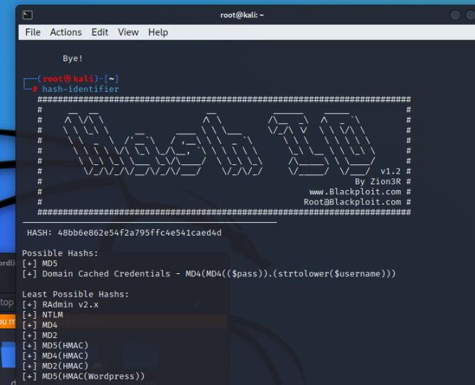

THM Link: https://tryhackme.com/r/room/crackthehash

**Level 1**

First try to find hash type with hash-identifier command

Once we identify hash type then we can find hash mode

https://hashcat.net/wiki/doku.php?id=example_hashes

We have hash type and hash mode -- > we can write our commend to find hash password

hashcat -m 0 48bb6e862e54f2a795ffc4e541caed4d /root/Desktop/wordlists/rockyou.txt

\`hashcat -m\` refers to the "hash mode" in \*\*Hashcat\*\*. The \`-m\` option specifies the hash type that you're trying to crack.

Different algorithms and formats use different hash types, so selecting the correct one is crucial for effective cracking.

Each \`-m\` value corresponds to a specific hash algorithm or encoding format. For example:

\- \`-m 0\`: MD5  
\- \`-m 100\`: SHA-1  
\- \`-m 1400\`: SHA-256  
\- \`-m 1800\`: SHA-512  
\- \`-m 2500\`: WPA/WPA2 (handshake)  
\- \`-m 3200\`: bcrypt  
\- \`-m 5600\`: NetNTLMv2  
\- \`-m 1000\`: NTLM (Windows hashes)

Can you complete the level 1 tasks by cracking the hashes?

**Q:** 48bb6e862e54f2a795ffc4e541caed4d -- easy

The hint says this is an md5 hash. Command to crack the hash: hashcat -m 0 hash1_1.txt /usr/share/wordlists/rockyou.txt --show  

**Q:** CBFDAC6008F9CAB4083784CBD1874F76618D2A97  -- password123

The hint says this is a sha.. hash. Since hashcat can crack only 4 types of sha hashes, I tried all of them until one was successful. Turns out it was a SHA1 hash. Command to crack the hash :

hashcat -m 100 CBFDAC6008F9CAB4083784CBD1874F76618D2A97 /usr/share/wordlists/rockyou.txt

  

**Q:** 1C8BFE8F801D79745C4631D09FFF36C82AA37FC4CCE4FC946683D7B336B63032 -- letmein

The hint says this is a sha.. hash. Same strategy used in the previous question. Turns out it was a SHA256 hash. Command used to crack the hash:  
hashcat -m 1400 1C8BFE8F801D79745C4631D09FFF36C82AA37FC4CCE4FC946683D7B336B63032 /usr/share/wordlists/rockyou.txt  
  

**Q:** \$2y121212Dwt1BZj6pcyc3Dy1FWZ5ieeUznr71EeNkJkUlypTsgbX1H68wsRom -- bleh

https://www.tunnelsup.com/hash-analyzer/  

https://hashes.com/en/decrypt/hash  

The hint says this is a bcrypt hash. Command used to crack the hash: hashcat -m 3200 hash1_4.txt /usr/share/wordlists/rockyou.txt

**Q:** 279412f945939ba78ce0758d3fd83daa -- Eternity22

The hint says this is a md4 hash. I tried using the following command used to crack the hash: hashcat -m 900 hash1_5.txt /usr/share/wordlists/rockyou.txt, yet hashcat didn't find the password in the rockyou.txt file, so I used the following online tool to crack the hash: link.  
https://crackstation.net/  

**Task 2: Level 2**  
This task increases the difficulty. All of the answers will be in the classic rock you password list.

You might have to start using hashcat here and not online tools. It might also be handy to look at some example hashes on hashcats page.

Hash: F09EDCB1FCEFC6DFB23DC3505A882655FF77375ED8AA2D1C13F640FCCC2D0C85

It seems this is a SHA256 hash. Command used to crack the hash: hashcat -m 1400 task_1.txt /usr/share/wordlists/rockyou.txt

**paule**

**Hash: 1DFECA0C002AE40B8619ECF94819CC1B -- n63umy8lkf4i**  
The hint says this is a NTLM hash. Command used to crack the hash: hashcat -m 1000 hash2_2.txt /usr/share/wordlists/rockyou.txt

  

n63umy8lkf4i  

Hash: 666aReallyHardSalt\$6WKUTqzq.UQQmrm0p/T7MPpMbGNnzXPMAXi4bJMl9be.cfi3/qxIf.hsGpS41BqMhSrHVXgMpdjS6xeKZAs02.

Salt: aReallyHardSalt

  

This one seems to be a SHA-512(Unix) hash. Command used to crack the hash: hashcat -m 1800 hash2_3.txt /usr/share/wordlists/rockyou.txt

waka99

Hash: e5d8870e5bdd26602cab8dbe07a942c8669e56d6  
Salt: tryhackme

hashcat -m 160 task_3.txt /root/Desktop/wordlists  
hashcat (v6.2.6) starting

  
  
the above image we did not put salt  
  

The hint says this one is a HMAC-SHA1 hash. Command used to crack the hash: hashcat -m 160 hash2_4.txt /usr/share/wordlists/rockyou.txt.

481616481616
